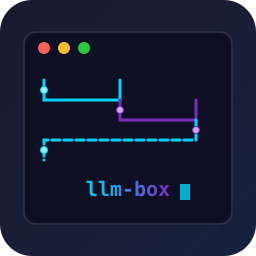

<div align="center">
  
  <h1>llm-box</h1>
  <p><strong>Turn Natural Language Into Executable Workflows</strong></p>
  <p>Agentic Workflow Engine for the Terminal — deterministic execution meets AI agents. Build self-driving workflows with autonomous agent nodes, tool use, and multi-step reasoning.</p>

  <p>
    <a href="https://github.com/alib8b8/llm-box/releases">
      
    </a>
    <a href="https://golang.org/">
      
    </a>
    <a href="LICENSE">
      
    </a>
    <a href="https://github.com/alib8b8/llm-box/actions/workflows/release.yml">
      
    </a>
    <a href="https://cobusgreyling.github.io/loop-engineering/">
      
    </a>
  </p>


</div>

---

## 🚀 Quick Start

Install in 60 seconds:

```bash
# Linux/macOS
curl -sL https://raw.githubusercontent.com/alib8b8/llm-box/main/install.sh -o install.sh
bash install.sh

# Windows
# Download from releases: https://github.com/alib8b8/llm-box/releases/latest
Invoke-WebRequest -Uri "https://github.com/alib8b8/llm-box/releases/latest/download/llm-box-windows-amd64.exe" -OutFile llm-box.exe
```

Create and run your first workflow in seconds:

```bash
# DevOps — monitor server health
llm-box create "Check my server CPU every 5 minutes and alert if high"

# AI Research — stay updated
llm-box create "Summarize today's AI news"

# Crypto Trading — automated alerts
llm-box create "Alert me when Bitcoin exceeds 100000"

# Run any workflow
llm-box run server_monitor.yaml
```

---

## 💡 Why Choose llm-box?

**Not Another AI Chatbot**

Most workflow tools force developers to choose between:

| Approach | Problem |
|----------|---------|
| Complex bash scripts | Hard to read, maintain, share |
| Heavy visual builders | Slow, opaque, require GUI |
| Endless config files | Steep learning curve, verbose syntax |

**llm-box is not just another workflow tool — it's a deterministic execution engine with agentic superpowers.**

- ✅ **Predictable & Auditable** — Workflow steps are deterministic, agent behavior is constrained
- ✅ **Agentic Nodes** — 10+ AI agent nodes: `agent` (ReAct), `planner`, `researcher`, `critic`, `evaluator`, `reflector`, `supervisor`, `code_review`, `router`, `human_in_loop`
- ✅ **Local-First** — Your data never leaves your terminal
- ✅ **Transparent & Reproducible** — Same workflow produces same results
- ✅ **MIT Open Source** — No vendor lock-in, no hidden barriers

> 💡 AI agents plan and reason, but llm-box's deterministic code execution keeps everything reliable.

---

## ✨ Features

1. **Generate workflows from plain English** — describe what you want, llm-box writes the YAML
2. **Run them locally** — single binary, zero dependencies, your data never leaves your machine
3. **Share them as reusable templates** — version, publish, and reuse workflows across projects

---

## ⚙️ How It Works

```
┌─────────┐     ┌─────────┐     ┌──────────────┐     ┌──────────┐     ┌────────┐
│  Prompt │────▶│ Planner │────▶│ Workflow YAML│────▶│ Executor │────▶│ Result │
└─────────┘     └─────────┘     └──────────────┘     └──────────┘     └────────┘
     │               │                  │                  │
     │               │                  │                  ▼
     │               │                  │           ┌──────────────┐
     │               │                  │           │  Agent Nodes │
     │               │                  │           │  ReAct Loop  │
     │               │                  │           └──────────────┘
     │               │                  │
     │               │                  ▼
     │               │           ┌──────────────┐
     │               │           │ Utility Nodes│
     │               │           │ fetch, exec  │
     │               │           └──────────────┘
     │               │
     ▼               ▼
┌─────────────────────────────────────────────────────────────┐
│          "Check server CPU every 5 minutes"                  │
│                      ↓                                       │
│      ┌─────────────────────────────┐                        │
│      │ steps:                      │                        │
│      │   - node: execute           │                        │
│      │     params:                 │                        │
│      │       command: top -bn1     │                        │
│      │   - node: transform         │                        │
│      │     params:                 │                        │
│      │       operation: extract_cpu│                        │
│      │   - node: notify            │                        │
│      │     params:                 │                        │
│      │       channel: stdout       │                        │
│      └─────────────────────────────┘                        │
└─────────────────────────────────────────────────────────────┘
```

1. **Prompt** — describe what you want in plain English
2. **Planner** — AI breaks it down into executable steps
3. **Workflow YAML** — generates a structured, versioned workflow file
4. **Executor** — runs each step deterministically (agent nodes use ReAct reasoning)
5. **Result** — output to terminal, file, or notification

---

## 🔒 Security

llm-box takes security seriously. Here's how we protect you:

### Command Execution Safety (`execute` node)

The `execute` node runs shell commands, which is inherently powerful and risky. llm-box implements multiple layers of defense:

| Layer | What it does | How to enable |
|-------|-------------|---------------|
| **Safe Mode** | Completely disables the `execute` node | `llm-box --safe-mode` or `LLM_BOX_SAFE_MODE=1` |
| **Allowlist** | Only allows known-safe commands; blocks shell metacharacters (`;`, `|`, `&`, `` ` ``, etc.) | `LLM_BOX_EXECUTE_ALLOWLIST=1` |
| **Audit Logging** | Every command logged to `~/.llm-box/logs/audit.log` with timestamp, user, and redacted secrets (0600 permissions) | Enabled automatically |
| **Dry Run** | Preview commands before execution without running them | `dry_run: true` param on `execute` node |
| **Timeout** | Commands auto-terminate after a configurable duration (default: 5m, max: 30m) | `timeout: 30s` param on `execute` node |
| **Input Validation** | Empty commands rejected; shell injection patterns blocked | Always on |

**Recommended setup for CI/production:**
```bash
export LLM_BOX_EXECUTE_ALLOWLIST=1
export LLM_BOX_SAFE_MODE=1   # if you don't need shell execution at all
```

### Secrets Management

API keys are **never stored in plain text**:

- AES-GCM encryption with PBKDF2 key derivation (100K iterations)
- Master password protected
- File permissions `0600`
- Values masked in listings (e.g., `sk-****bc`)
- Automatic redaction in audit logs (Bearer tokens, Authorization headers, URL credentials)

```bash
llm-box secrets add --group llm --key openai --value sk-...
llm-box secrets list llm
```

#### Using Secrets in Workflows

Reference stored secrets in your workflow YAML using the `{{secret.GROUP.KEY}}` syntax:

```yaml
steps:
  - node: openai
    params:
      model: gpt-4o
      api_key: "{{secret.llm.openai}}"
    input: "Summarize this article"

  - node: http_request
    params:
      url: "https://api.example.com/data"
      headers: "Authorization: Bearer {{secret.api.example}}"
```

**Supported Expression Syntax:**

| Expression | Description | Example |
|------------|-------------|---------|
| `{{secret.llm.openai}}` | Secret value from group/key | API key |
| `{{var.name}}` | Workflow variable | Defined in vars section |
| `{{env.NAME}}` | Environment variable | OS env var |
| `{{step.0}}` | Output of step 0 | Previous step output |
| `{{step.name}}` | Output by step name | Named step output |
| `{{input}}` | Workflow initial input | User-provided input |

**Setup:**
1. Set `LLM_BOX_SECRETS_PASSWORD` environment variable
2. Add secrets via CLI: `llm-box secrets add --group llm --key openai --value sk-...`
3. Reference in YAML: `{{secret.llm.openai}}`

#### Audit Logs

All commands are automatically logged with the following details:

```bash
# Default log path
~/.llm-box/logs/audit.log

# View recent logs
tail -f ~/.llm-box/logs/audit.log

# Search logs by keyword
grep "openai" ~/.llm-box/logs/audit.log

# Search failed operations
grep -i "error\|failed" ~/.llm-box/logs/audit.log
```

**Log Format:**

```json
{
  "time": "2026-07-16T10:00:00Z",
  "level": "info",
  "command": "run",
  "workflow": "my-workflow.yaml",
  "steps": 5,
  "duration_ms": 12345,
  "user": "john",
  "hostname": "workstation",
  "secrets_redacted": true
}
```

**Log Fields:**

| Field | Description |
|-------|-------------|
| `time` | ISO 8601 timestamp |
| `level` | Log level (info, warn, error) |
| `command` | Command executed |
| `workflow` | Workflow file name |
| `steps` | Number of steps |
| `duration_ms` | Execution duration in milliseconds |
| `user` | Current user |
| `hostname` | Machine hostname |
| `secrets_redacted` | Whether secrets were redacted |

**Security:**
- File permissions: `0600` (read/write only by owner)
- Secrets are automatically redacted from logs
- Environment variable override: `LLM_BOX_LOG_FILE=/path/to/audit.log`

### Secure Installation

The `curl | bash` pattern is convenient but carries supply-chain risk. For maximum safety:

```bash
# Option 1: Download + verify checksum
curl -sL https://github.com/alib8b8/llm-box/releases/latest/download/llm-box-linux-amd64 -o llm-box
curl -sL https://github.com/alib8b8/llm-box/releases/latest/download/checksums.txt -o checksums.txt
sha256sum -c checksums.txt
chmod +x llm-box

# Option 2: Build from source
git clone https://github.com/alib8b8/llm-box.git
cd llm-box
go build -o llm-box ./cmd/llm-box
```

### Automated Security Scanning

Every PR is scanned with:
- **gosec** — security-focused static analysis
- **CodeQL** — GitHub's semantic analysis engine
- **go vet** — Go compiler static analysis
- **gofmt** — format consistency

See [SECURITY.md](SECURITY.md) for our vulnerability disclosure policy.

---

## 🔄 When To Use llm-box

We recommend the right tool for the job:

| Scenario | Recommended Tool | Why |
|----------|-----------------|-----|
| **Terminal automation & scripts** | **llm-box** | Natural language to YAML, deterministic execution, no dependencies |
| **Enterprise workflow orchestration** | n8n / Dify | Visual builder, enterprise integrations, role-based access |
| **AI-powered coding assistant** | Claude Code / Cursor | Deep IDE integration, codebase awareness, iterative coding |
| **Pure AI agent orchestration** | CrewAI / LangGraph | Multi-agent frameworks, Python-native, research-oriented |
| **Data ETL pipelines** | Apache Airflow / Dagster | DAG scheduling, data lineage, observability at scale |
| **Infrastructure as Code** | Terraform / Pulumi | Cloud resource management, state tracking, plan/apply workflow |
| **Scheduled cron jobs** | systemd timers / cron | Unix-native, zero overhead, battle-tested |
| **API testing & mocking** | Postman / Insomnia | Interactive request builder, collection sharing, collaboration |

### llm-box is built for engineers who want to:

- Replace fragile bash scripts with **structured, versioned workflows**
- Add **AI reasoning** to terminal automation without leaving the command line
- Keep **full transparency** — every step is YAML, auditable, and reproducible
- Stay **local-first** — no cloud dependency, no vendor lock-in

> 📖 [Full comparison →](docs/comparison.md)

---

## 🤖 Agent Nodes

llm-box includes **10 specialized AI agent nodes** that bring autonomous reasoning to your workflows:

### Core Agents

| Node | Description | Use Case |
|------|-------------|----------|
| `agent` | General-purpose ReAct agent with tool use | Autonomous task completion |
| `supervisor` | Supervisor agent that decomposes tasks and delegates to specialists | Orchestrating multi-agent workflows |

### Specialist Agents

| Node | Description | Use Case |
|------|-------------|----------|
| `planner` | Task decomposition agent | Break complex goals into steps |
| `researcher` | Research agent with web sources | Information gathering & synthesis |
| `critic` | Quality review agent that critiques and suggests improvements | Output quality control |
| `evaluator` | Scoring agent with rubrics and pass/fail thresholds | Quality gates & assessment |
| `reflector` | Self-reflection agent that iteratively improves output | Self-correction & refinement |
| `code_review` | Code review specialist agent | Automated code quality checks |
| `router` | Classification & routing agent | Smart workflow branching |

### Control Nodes

| Node | Description | Use Case |
|------|-------------|----------|
| `human_in_loop` | Human approval gate for workflow steps | Human review & sign-off |

### Example: Autonomous Research Workflow

```yaml
name: AI Research Agent
steps:
  - node: agent
    params:
      provider: ollama
      model: llama3
      tools: fetch_url,json_parse
      max_iterations: 5
    input: |
      Research the latest trends in agentic workflow engines.
      Fetch information from 2 sources and summarize key findings.
```

### Example: Multi-Agent Quality Pipeline

```yaml
name: Content Quality Pipeline
steps:
  - node: file_read
    params:
      path: draft.md
  - node: critic
    params:
      provider: ollama
      model: llama3
      role: writing
      suggest_improvements: "true"
  - node: evaluator
    params:
      provider: ollama
      model: llama3
      rubric: quality
      scale: "1-10"
      threshold: "7"
  - node: reflector
    params:
      provider: ollama
      model: llama3
      iterations: "2"
      reflection_focus: all
  - node: human_in_loop
    params:
      mode: file
      approval_file: .content-approved
  - node: file_write
    params:
      path: final.md
```

---

## 🎬 Demo

### 1. Generate Workflow from Plain English

```bash
$ llm-box create "check server CPU every 5 minutes and alert if > 80%"

✓ Generated workflow: cpu-monitor.yaml

steps:
  - node: execute
    params:
      command: "top -bn1 | grep 'Cpu(s)'"
  - node: transform
    params:
      operation: extract_cpu_percent
  - node: agent
    params:
      provider: ollama
      model: llama3
    input: "Alert if CPU usage exceeds 80%"
  - node: notify
    params:
      channel: stdout
```

### 2. Run the Workflow

### `llm-box create` Command Reference

Generate workflows from natural language descriptions using rule-based keyword matching.

**Usage**:
```bash
llm-box create "your natural language description" [options]
```

**Options**:
| Option | Description |
|--------|-------------|
| `-o`, `--output` | Output file path (default: auto-generated) |
| `--name` | Workflow name |
| `--dry-run` | Preview generated workflow without saving |
| `--provider` | Preferred LLM provider (openai, ollama, etc.) |

**Examples**:
```bash
# Basic creation
llm-box create "Fetch weather and save to file"

# Specify output file
llm-box create "Summarize GitHub activity" -o github-summary.yaml

# Preview without saving
llm-box create "Monitor server logs" --dry-run

# Specify preferred LLM provider
llm-box create "Analyze code" --provider openai
```

**Generated YAML**:
```bash
$ llm-box create "check server CPU every 5 minutes and alert if > 80%"

✓ Generated workflow: cpu-monitor.yaml

steps:
  - node: execute
    params:
      command: "top -bn1 | grep 'Cpu(s)'"
  - node: transform
    params:
      operation: extract_cpu_percent
  - node: agent
    params:
      provider: ollama
      model: llama3
    input: "Alert if CPU usage exceeds 80%"
  - node: notify
    params:
      channel: stdout
```

**Supported Keywords**:
| Keyword | Action | Example |
|---------|--------|---------|
| `fetch`, `get`, `download` | HTTP request | "Fetch API data" |
| `read`, `load` | File read | "Read config file" |
| `write`, `save` | File write | "Save to report.md" |
| `summarize`, `analyze`, `review` | LLM agent | "Summarize document" |
| `notify`, `alert`, `send` | Notification | "Notify on Slack" |
| `execute`, `run`, `command` | Shell execute | "Run backup script" |
| `json`, `parse` | JSON parse | "Parse JSON response" |
| `combine`, `merge` | Combine outputs | "Combine two files" |

**Limitations**:
- Rule-based generation (not AI-powered)
- Supports a fixed set of keywords
- For complex workflows, define YAML directly

### 2. Run the Workflow

```bash
$ llm-box run cpu-monitor.yaml

▶ cpu-monitor.yaml
  [1/4] execute     → top -bn1 | grep 'Cpu(s)'          ✓ 0.3s
  [2/4] transform   → extract_cpu_percent                ✓ 0.1s
  [3/4] agent       → llama3 reasoning...                ✓ 2.1s
  [4/4] notify      → channel=stdout                     ✓ 0.0s

Result: CPU at 45% — within normal range

✓ Workflow completed in 2.5s
```

### 3. Retry on Failure with Logs

```bash
$ llm-box run api-health-check.yaml

▶ api-health-check.yaml
  [1/3] http_request → GET https://api.example.com/health
  ⚠ Request failed: connection timeout
  ↻ Retry 1/3 after 5s...                                  ✓ 5.8s
  [2/3] json_parse   → status                             ✓ 0.1s
  [3/3] notify       → channel=stdout                     ✓ 0.0s

Result: API healthy — status: "ok"

✓ Workflow completed in 6.2s (1 retry)

📋 Audit log: ~/.llm-box/logs/2026-07-16_14-32-10_api-health-check.log
```

> **Record your own GIF**
> Use [vhs](https://github.com/charmbracelet/vhs) with `docs/demo.tape` to create high-quality terminal recordings.

---

## 🔧 Architecture

```
┌─────────────────────────────────────────────────────────────────────┐
│                        User Interfaces                             │
│  ┌──────────────────────┐  ┌────────────────────────────────────┐  │
│  │      Terminal CLI    │  │            Web UI Editor           │  │
│  │   llm-box create/run │  │  Visual workflow builder & preview │  │
│  └──────────────────────┘  └────────────────────────────────────┘  │
└─────────────────────────────────────────────────────────────────────┘
                             │                    │
                             ▼                    ▼
┌─────────────────────────────────────────────────────────────────────┐
│                  Natural Language Parser + Task Planner            │
│            "Fetch HN stories and summarize" → Executable Steps    │
└─────────────────────────────────────────────────────────────────────┘
                             │
          ┌──────────────────┼──────────────────┐
          ▼                  ▼                  ▼
┌─────────────────┐  ┌─────────────────┐  ┌─────────────────┐
│   Coordinator   │  │   Coordinator   │  │   Coordinator   │
│  (Node Manager) │  │  (Task Router)  │  │  (Heartbeat)    │
└─────────────────┘  └─────────────────┘  └─────────────────┘
          │                  │                  │
          └──────────────────┼──────────────────┘
                             ▼
┌─────────────────────────────────────────────────────────────────────┐
│                     Distributed Worker Nodes                        │
│  ┌──────────┐ ┌───────────┐ ┌────────────┐ ┌───────────┐ ┌────────┐ │
│  │fetch_url │ │transform  │ │execute_cmd │ │file_write │ │  LLM   │ │
│  └──────────┘ └───────────┘ └────────────┘ └───────────┘ └────────┘ │
│  ┌──────────┐ ┌───────────┐ ┌────────────┐ ┌───────────┐ ┌────────┐ │
│  │http_req  │ │json_parse │ │template    │ │secrets    │ │plugins│ │
│  └──────────┘ └───────────┘ └────────────┘ └───────────┘ └────────┘ │
│  ┌──────────┐ ┌───────────┐ ┌────────────┐ ┌───────────┐ ┌────────┐ │
│  │  agent   │ │ planner   │ │ researcher │ │  critic   │ │evaluator│
│  │ (ReAct)  │ │           │ │            │ │           │ │        │
│  └──────────┘ └───────────┘ └────────────┘ └───────────┘ └────────┘ │
│  ┌──────────┐ ┌───────────┐ ┌────────────┐ ┌───────────┐ ┌────────┐ │
│  │reflector │ │supervisor │ │code_review │ │  router   │ │human_in│
│  │          │ │           │ │            │ │           │ │_loop   │
│  └──────────┘ └───────────┘ └────────────┘ └───────────┘ └────────┘ │
└─────────────────────────────────────────────────────────────────────┘
                             │
                             ▼
┌─────────────────────────────────────────────────────────────────────┐
│                       Output + Visualization                        │
│            (Terminal / File / Notification / Mermaid Diagram)      │
└─────────────────────────────────────────────────────────────────────┘
```

**Components:**
1. **Parser** - Interprets plain English commands
2. **Planner** - Breaks down into executable steps
3. **Coordinator** - Manages distributed nodes, assigns tasks, monitors heartbeats
4. **Workers** - Execute workflow steps across multiple machines
5. **Nodes** - Built-in and extensible actions (17+ utility and LLM nodes)
6. **Web UI** - Visual workflow editor with real-time preview
7. **Visualizer** - Generates Mermaid/JSON/DOT/ASCII diagrams
8. **Output** - Formatted results to terminal, file, or notifications

---

## 🏪 Marketplace

Browse and install ready-made workflow templates from the community:

| Template | Description | Install |
|----------|-------------|---------|
| **btc-alert** | Monitor Bitcoin price and alert on threshold | `llm-box install btc-alert` |
| **ai-news** | Daily AI/ML news summary from Hacker News | `llm-box install ai-news` |
| **github-report** | Weekly GitHub activity report (issues, PRs, commits) | `llm-box install github-report` |
| **telegram-bot** | Send notifications to Telegram | `llm-box install telegram-bot` |
| **seo-writer** | Generate SEO-optimized articles with audit | `llm-box install seo-writer` |

### Install a template

```bash
llm-box install btc-alert
llm-box run templates/btc-alert/workflow.yaml
```

### Submit your own

1. Create a directory under `templates/<your-template>/`
2. Include `workflow.yaml` and `README.md`
3. Open a PR — the community will review and merge

**See [templates/](templates/) for all available templates.**

---

## 📚 10 Real Use Cases

| # | Use Case | Command | Example |
|---|----------|---------|---------|
| 1 | GitHub Daily Digest | `llm-box create "fetch my recent GitHub activity and save summary"` | [github-daily-digest.yaml](examples/github-daily-digest.yaml) |
| 2 | Research Assistant | `llm-box create "fetch 3 tech blog posts and save key takeaways"` | [research-assistant.yaml](examples/research-assistant.yaml) |
| 3 | Documentation Generator | `llm-box create "scan my Go project and generate API overview"` | [docs-generator.yaml](examples/docs-generator.yaml) |
| 4 | Log Monitor | `llm-box create "monitor server logs for 5xx errors and alert"` | [log-monitor.yaml](examples/log-monitor.yaml) |
| 5 | Release Notes Creator | `llm-box create "turn git commit history into release notes"` | [release-notes.yaml](examples/release-notes.yaml) |
| 6 | Data Collector | `llm-box create "fetch weather and stock data, combine into report"` | [data-collector.yaml](examples/data-collector.yaml) |
| 7 | File Organizer | `llm-box create "organize downloads folder by file type"` | [file-organizer.yaml](examples/file-organizer.yaml) |
| 8 | Content Workflow | `llm-box create "take markdown post and generate HTML version"` | [content-processor.yaml](examples/content-processor.yaml) |
| 9 | DevOps Automation | `llm-box create "build docker image and deploy with health check"` | [devops-deploy.yaml](examples/devops-deploy.yaml) |
| 10 | Team Reporting | `llm-box create "compile weekly issue and commit stats"` | [team-report.yaml](examples/team-report.yaml) |

**See [examples/](examples/) for full workflow definitions.**

---

## ❓ FAQ

### What makes this different from Bash scripts?
llm-box adds structure, reusability, and a beautiful UI without losing the power of the terminal.

### Do I have to write YAML?
No for getting started — describe what you want in plain English, and llm-box generates the YAML for you. For advanced use, you can edit the generated YAML directly for fine-grained control.

### Can I extend it?
Yes! Build custom nodes in any language. See [docs/contributing.md](docs/contributing.md).

### Is it production-ready?
v0.3 is the current stable version with core features including workflow engine, 15+ LLM providers, distributed execution, Web UI, and MCP integration. v1.0 is planned for Q3 2026.

### Which platforms are supported?
Linux, macOS, and Windows are fully supported.

### Where can I get help?
Open a [GitHub Discussion](https://github.com/alib8b8/llm-box/discussions) or file an issue.

---

## 🔧 Built-in Utility Nodes

llm-box includes many utility nodes for common tasks:

### file_read
Reads content from a local file.

**Parameters:**
- `path` (required) - Path to the file to read

**Example:**
```yaml
- node: file_read
  params:
    path: "input.txt"
```

### file_write
Writes input content to a file.

**Parameters:**
- `path` (required) - Path to the output file

**Example:**
```yaml
- node: file_write
  params:
    path: "output.txt"
```

### fetch_url
Fetches content from a URL.

**Parameters:**
- `url` (required) - URL to fetch

**Example:**
```yaml
- node: fetch_url
  params:
    url: "https://example.com"
```

### execute
Executes a shell command.

**Parameters:**
- `command` (required) - Command to execute

**Example:**
```yaml
- node: execute
  params:
    command: "ls -la"
```

### transform
Deterministic text transformation using pure string/regex operations — no LLM calls. Supported operations: `upper`, `lower`, `trim`, `lines`, `words`, `chars`, `first_line`, `first_500`, `first_1000`, `summary`, `reverse`, `unique_lines`, `sort_lines`, `remove_blank_lines`, `filter_errors`, `extract_urls`, `extract_emails`, `markdown_to_html`, `html_to_markdown`, and domain-specific helpers like `extract_repos_and_activity`, `group_by_commit_type`, `group_by_extension`.

**Parameters:**
- `operation` - Operation to perform (upper, lower, trim, etc.)

**Example:**
```yaml
- node: transform
  params:
    operation: "upper"
```

### combine
Combines multiple inputs.

### notify
Sends a desktop notification.

### json_parse
Parses JSON and extracts specific fields using dot notation.

**Parameters:**
- `path` (optional) - JSON path to extract (e.g., `user.name`, `items.[0].title`). If omitted, returns formatted JSON.

**Example:**
```yaml
- node: json_parse
  params:
    path: "name"
```

### http_request
Makes HTTP requests to any API endpoint. More flexible than `fetch_url`.

**Parameters:**
- `url` (required) - URL to request
- `method` (optional) - HTTP method (GET, POST, PUT, DELETE, etc.). Default: GET
- `body` (optional) - Request body. Uses step input if not provided
- `content_type` (optional) - Content-Type header. Default: application/json for POST/PUT
- `headers` (optional) - Additional headers, one per line, format: `Key: Value`
- `timeout` (optional) - Request timeout (e.g., `30s`, `2m`). Default: 60s

**Example:**
```yaml
- node: http_request
  params:
    url: "https://api.example.com/data"
    method: "POST"
    content_type: "application/json"
    headers: |
      Authorization: Bearer token123
      X-Custom-Header: value
```

### template_render
Renders a Go template with input data and parameters.

**Parameters:**
- `template` or `template_file` (required) - Template string or path to template file
- Additional params are available as template variables

**Available template functions:** `upper`, `lower`, `title`, `trim`, `split`, `join`, `len`, `replace`

**Example:**
```yaml
- node: template_render
  params:
    template: |
      # Report
      Name: {{ .name }}
      Date: {{ .date }}
    name: "My Report"
    date: "2026-06-29"
```

### condition
Evaluates a condition and returns "true" or "false".

**Parameters:**
- `condition` (required) - Condition expression

**Supported operators:** `contains`, `matches`, `==`, `!=`, `<`, `>`, `<=`, `>=`

**Example:**
```yaml
- node: condition
  params:
    condition: "{{input}} contains 'error'"
```

### agent
Generic LLM agent node that supports multiple providers.

**Parameters:**
- `provider` - LLM provider (openai, ollama, coze, fastgpt, ima)
- `model` - Model name
- `prompt` - Prompt template
- `stream` (optional) - Enable streaming output. Default: true

**Example:**
```yaml
- node: agent
  params:
    provider: openai
    model: gpt-4o
    prompt: "Summarize this: {{input}}"
```

### openai
Calls OpenAI's API.

**Parameters:**
- `model` (required) - Model name (e.g., gpt-4o, gpt-4-turbo)
- `api_key` (optional) - API key (uses secret if not provided)
- `prompt` - Prompt template
- `temperature` (optional) - Temperature (0-2). Default: 0.7

**Example:**
```yaml
- node: openai
  params:
    model: gpt-4o
    api_key: "{{secret.llm.openai}}"
    prompt: "Analyze this data: {{input}}"
```

### ollama
Calls local Ollama models.

**Parameters:**
- `model` (required) - Model name (e.g., llama3, mistral)
- `prompt` - Prompt template
- `temperature` (optional) - Temperature (0-2). Default: 0.7

**Example:**
```yaml
- node: ollama
  params:
    model: llama3
    prompt: "Summarize this: {{input}}"
```

### coze
Calls Coze AI API.

**Parameters:**
- `model` (required) - Model name
- `api_key` (optional) - API key (uses secret if not provided)
- `prompt` - Prompt template

**Example:**
```yaml
- node: coze
  params:
    model: coze-chat
    api_key: "{{secret.llm.coze}}"
```

### fastgpt
Calls FastGPT API.

**Parameters:**
- `model` (required) - Model name
- `api_key` (optional) - API key (uses secret if not provided)
- `prompt` - Prompt template

**Example:**
```yaml
- node: fastgpt
  params:
    model: fastgpt-chat
    api_key: "{{secret.llm.fastgpt}}"
```

### ima
Calls IMA (Intelligent Multi-Agent) API.

**Parameters:**
- `model` (required) - Model name
- `api_key` (optional) - API key (uses secret if not provided)
- `prompt` - Prompt template

**Example:**
```yaml
- node: ima
  params:
    model: ima-7b
    api_key: "{{secret.llm.ima}}"
```

### call
Calls another workflow file.

**Parameters:**
- `workflow` (required) - Path to workflow file
- `input` (optional) - Input to pass to the workflow

**Example:**
```yaml
- node: call
  params:
    workflow: "sub-workflow.yaml"
```

### planner
Generates a plan for complex tasks.

**Parameters:**
- `task` (required) - Task description
- `model` (optional) - LLM model to use

**Example:**
```yaml
- node: planner
  params:
    task: "Create a web scraper for example.com"
```

### code_review
Reviews code for issues and improvements.

**Parameters:**
- `model` (optional) - LLM model to use

**Example:**
```yaml
- node: code_review
  input: "{{step.code_output}}"
  params:
    model: gpt-4o
```

### critic
Provides critical feedback on content.

**Parameters:**
- `model` (optional) - LLM model to use
- `focus` (optional) - Focus area (quality, accuracy, clarity)

**Example:**
```yaml
- node: critic
  input: "{{step.report}}"
  params:
    model: gpt-4o
    focus: "accuracy"
```

### evaluator
Evaluates content against criteria.

**Parameters:**
- `criteria` (required) - Evaluation criteria
- `model` (optional) - LLM model to use

**Example:**
```yaml
- node: evaluator
  input: "{{step.response}}"
  params:
    criteria: "Is this response accurate and helpful?"
```

### router
Routes input to different nodes based on conditions.

**Parameters:**
- `routes` (required) - Array of route conditions and targets

**Example:**
```yaml
- node: router
  params:
    routes: |
      if contains(input, "code") then code_review
      if contains(input, "question") then agent
      else file_write
```

### supervisor
Monitors and manages workflow execution.

**Parameters:**
- `max_steps` (optional) - Maximum steps allowed
- `timeout` (optional) - Overall timeout

**Example:**
```yaml
- node: supervisor
  params:
    max_steps: 100
    timeout: "30m"
```

### researcher
Performs research and information gathering.

**Parameters:**
- `query` (required) - Research query
- `model` (optional) - LLM model to use

**Example:**
```yaml
- node: researcher
  params:
    query: "Latest developments in AI"
```

### human_in_loop
Pauses for human input/approval.

**Parameters:**
- `prompt` (required) - Prompt for human operator

**Example:**
```yaml
- node: human_in_loop
  params:
    prompt: "Review the generated code and approve?"
```

### reflector
Reflects on previous steps and provides insights.

**Parameters:**
- `model` (optional) - LLM model to use

**Example:**
```yaml
- node: reflector
  input: "{{step.execution_history}}"
```

---

## 🤖 Supported LLMs

llm-box supports multiple LLM providers out of the box:

### DeepSeek (Cloud API)

The `deepseek` node calls DeepSeek's official API. Perfect when you don't want to run models locally.

**Setup:**
```bash
export DEEPSEEK_API_KEY="your-api-key"
```

**Example workflow:**
```yaml
name: DeepSeek Summary
steps:
  - node: fetch_url
    params:
      url: "https://example.com"
  - node: deepseek
    params:
      model: "deepseek-chat"
      system: "You are a helpful assistant that summarizes text concisely."
  - node: file_write
    params:
      path: "summary.txt"
```

**Available models:**
- `deepseek-chat` - General purpose chat model
- `deepseek-coder` - Code generation model
- `deepseek-reasoner` - Reasoning model (R1)

### Coze (Cloud API)

The `coze` node calls ByteDance's Coze API (OpenAI compatible). Great for Chinese language tasks.

**Setup:**
```bash
export COZE_API_KEY="your-api-key"
```

**Example workflow:**
```yaml
name: Coze Summary
steps:
  - node: fetch_url
    params:
      url: "https://example.com"
  - node: coze
    params:
      model: "glm-4"
      system: "You are a helpful assistant that summarizes text concisely."
  - node: file_write
    params:
      path: "summary.txt"
```

**Available models:**
- `glm-4` - General purpose high-performance model
- `glm-4v` - Vision-capable model
- `glm-3-turbo` - Fast and cost-effective model

### Zhipu GLM (Cloud API)

The `glm` node calls Zhipu AI's GLM API (OpenAI compatible). Native Chinese language support.

**Setup:**
```bash
export GLM_API_KEY="your-api-key"
```

**Example workflow:**
```yaml
name: GLM Summary
steps:
  - node: fetch_url
    params:
      url: "https://example.com"
  - node: glm
    params:
      model: "glm-4"
      system: "You are a helpful assistant that summarizes text concisely."
  - node: file_write
    params:
      path: "summary.txt"
```

**Available models:**
- `glm-4` - Flagship model with strong reasoning
- `glm-4v` - Vision language model
- `glm-3-turbo` - Fast, cost-effective option
- `glm-4-plus` - High intelligence, longer context

### Kimi (Cloud API)

The `kimi` node calls Moonshot AI's Kimi API (OpenAI compatible). Known for long context windows.

**Setup:**
```bash
export KIMI_API_KEY="your-api-key"
```

**Example workflow:**
```yaml
name: Kimi Summary
steps:
  - node: fetch_url
    params:
      url: "https://example.com"
  - node: kimi
    params:
      model: "moonshot-v1-8k"
      system: "You are a helpful assistant that summarizes text concisely."
  - node: file_write
    params:
      path: "summary.txt"
```

**Available models:**
- `moonshot-v1-8k` - 8K context, standard
- `moonshot-v1-32k` - 32K context, long documents
- `moonshot-v1-128k` - 128K context, massive files

### MiniMax (Cloud API)

The `minimax` node calls MiniMax's API (OpenAI compatible). Strong Chinese language understanding.

**Setup:**
```bash
export MINIMAX_API_KEY="your-api-key"
```

**Example workflow:**
```yaml
name: MiniMax Summary
steps:
  - node: fetch_url
    params:
      url: "https://example.com"
  - node: minimax
    params:
      model: "abab6.5s-chat"
      system: "You are a helpful assistant that summarizes text concisely."
  - node: file_write
    params:
      path: "summary.txt"
```

**Available models:**
- `abab6.5s-chat` - Fast & balanced
- `abab6.5t-chat` - Text focused
- `abab7-chat` - Latest generation

### Qwen (Cloud API)

The `qwen` node calls Alibaba's Tongyi Qianwen API (OpenAI compatible). Strong ecosystem integration with Alibaba Cloud.

**Setup:**
```bash
export QWEN_API_KEY="your-api-key"
```

**Example workflow:**
```yaml
name: Qwen Summary
steps:
  - node: fetch_url
    params:
      url: "https://example.com"
  - node: qwen
    params:
      model: "qwen-turbo"
      system: "You are a helpful assistant that summarizes text concisely."
  - node: file_write
    params:
      path: "summary.txt"
```

**Available models:**
- `qwen-turbo` - Fast & cost-effective
- `qwen-plus` - Balanced performance
- `qwen-max` - Maximum capability
- `qwen-long` - Long context (10M tokens)
- `qwen-vl-max` - Vision language model

### XVERSE (Cloud API)

The `xverse` node calls XVERSE's API (OpenAI compatible).

**Setup:**
```bash
export XVERSE_API_KEY="your-api-key"
```

**Available models:**
- `XVERSE-7B-Chat` - Lightweight fast model
- `XVERSE-13B-Chat` - Balanced performance
- `XVERSE-65B-Chat` - High capability

### Yi (Lingyiwanwu) (Cloud API)

The `yi` node calls Lingyiwanwu's Yi API (OpenAI compatible).

**Setup:**
```bash
export YI_API_KEY="your-api-key"
```

**Available models:**
- `yi-lightning` - Lightning fast
- `yi-large` - Large high-quality model
- `yi-medium` - Balanced
- `yi-vision` - Vision capability

### Baichuan (Cloud API)

The `baichuan` node calls Baichuan's API (OpenAI compatible).

**Setup:**
```bash
export BAICHUAN_API_KEY="your-api-key"
```

**Available models:**
- `Baichuan4` - Latest flagship model
- `Baichuan3-Turbo` - Fast & cost-effective
- `Baichuan2` - Previous generation

### InternLM (Open-Source) (Cloud API)

The `internlm` node calls Shanghai AI Lab's InternLM API (OpenAI compatible).

**Setup:**
```bash
export INTERNLM_API_KEY="your-api-key"
```

**Available models:**
- `internlm3-latest` - Latest generation
- `internlm2.5-latest` - v2.5 series
- `internlm2-latest` - v2 series
- `internlm-xcomposer` - Vision-language

### Mistral AI (Cloud API)

The `mistral` node calls Mistral AI's API (OpenAI compatible).

**Setup:**
```bash
export MISTRAL_API_KEY="your-api-key"
```

**Example workflow:**
```yaml
name: Mistral Summary
steps:
  - node: fetch_url
    params:
      url: "https://example.com"
  - node: mistral
    params:
      model: "mistral-large-latest"
      system: "You are a helpful assistant that summarizes text concisely."
  - node: file_write
    params:
      path: "mistral_summary.txt"
```

**Available models:**
- `mistral-large-latest` - Latest flagship model
- `mistral-medium-latest` - Balanced performance
- `mistral-small-latest` - Fast & cost-effective
- `open-mistral-nemo` - Open source model

### Xiaomi MiMo (Cloud API)

The `mimo` node calls Xiaomi MiMo's API (OpenAI compatible).

**Setup:**
```bash
export MIMO_API_KEY="your-api-key"
```

**Example workflow:**
```yaml
name: MiMo Summary
steps:
  - node: fetch_url
    params:
      url: "https://example.com"
  - node: mimo
    params:
      model: "mimo-v2.5-pro"
      system: "You are a helpful assistant that summarizes text concisely."
  - node: file_write
    params:
      path: "mimo_summary.txt"
```

**Available models:**
- `mimo-v2.5-pro` - Latest flagship model
- `mimo-v2.5-plus` - Enhanced version
- `mimo-v2.5-lite` - Lightweight version

### IMA Copilot (Cloud API)

The `ima` node connects to IMA Copilot's OpenAI-compatible API endpoint.

**Setup:**
```bash
export IMA_API_KEY="your-api-key"
export IMA_API_BASE="https://your-ima-endpoint/v1"
```

**Example workflow:**
```yaml
name: IMA Copilot Summary
steps:
  - node: fetch_url
    params:
      url: "https://example.com"
  - node: ima
    params:
      model: "gpt-4o"
      system: "You are a helpful assistant that summarizes text concisely."
  - node: file_write
    params:
      path: "summary.txt"
```

**Supported models:**
- `gpt-4o` - High capability
- `gpt-4o-mini` - Fast & cost-effective
- `gpt-4.1` - Latest generation
- `gpt-5` - Most capable

### FastGPT (Knowledge Base Platform)

The `fastgpt` node connects to [FastGPT](https://github.com/labring/FastGPT) knowledge base applications. Perfect for querying enterprise knowledge bases, documentation, and custom datasets.

**Setup:**
```bash
export FASTGPT_API_KEY="your-api-key"
export FASTGPT_BASE_URL="https://your-fastgpt-domain.com/api/v1"
```

**Example workflow:**
```yaml
name: FastGPT Knowledge Query
steps:
  - node: fastgpt
    params:
      app_id: "your-app-id"
      api_key: "your-api-key"
      endpoint: "https://your-fastgpt-domain.com/api/v1"
  - node: file_write
    params:
      path: "answer.txt"
```

**Parameters:**
- `app_id` - FastGPT application ID (required)
- `api_key` - API key (or set `FASTGPT_API_KEY` env var)
- `endpoint` - FastGPT API base URL (or set `FASTGPT_BASE_URL` env var)
- `chat_id` - Conversation ID for context persistence (optional)
- `system` - System prompt (optional)

**💡 Use cases:**
- Query enterprise documentation from the terminal
- Batch process knowledge base queries
- Build automated QA pipelines
- Combine with `file_read` to import local docs into FastGPT via API

### Ollama (Local)

The `ollama` node runs models locally via Ollama. Great for privacy and offline use.

**Setup:**
```bash
# Install Ollama
curl -fsSL https://ollama.com/install.sh -o ollama-install.sh
sh ollama-install.sh

# Pull a model
ollama pull llama3
```

### OpenAI Compatible (Any Provider)

The `openai` node works with **any** API that follows the OpenAI format — SiliconFlow, Together AI, 腾讯混元, and hundreds more.

**Setup:**
```bash
export OPENAI_API_KEY="your-api-key"
export OPENAI_API_BASE="https://api.siliconflow.cn/v1"
```

**Example — SiliconFlow (30+ models):**
```yaml
name: SiliconFlow Summary
steps:
  - node: fetch_url
    params:
      url: "https://example.com"
  - node: openai
    params:
      model: "deepseek-ai/DeepSeek-V3"
      endpoint: "https://api.siliconflow.cn/v1"
      system: "You are a helpful assistant that summarizes text concisely."
  - node: file_write
    params:
      path: "summary.txt"
```

**Example — OpenRouter (200+ models):**
```yaml
name: OpenRouter Summary
steps:
  - node: fetch_url
    params:
      url: "https://example.com"
  - node: openai
    params:
      model: "openai/gpt-4o"
      endpoint: "https://openrouter.ai/api/v1"
      system: "You are a helpful assistant that summarizes text concisely."
  - node: file_write
    params:
      path: "summary.txt"
```

**Setup for OpenRouter:**
```bash
export OPENAI_API_KEY="your-openrouter-api-key"
export OPENAI_API_BASE="https://openrouter.ai/api/v1"
```

**Works with:**
- [OpenRouter](https://openrouter.ai) - 200+ models from top providers
- SiliconFlow (硅基流动) - 30+ models, 0.5元/百万token起
- 腾讯混元 (Hunyuan)
- Together AI
- Anyscale
- Any OpenAI-compatible endpoint

---

## 🗺️ Roadmap

| Version | Milestone | Status |
|---------|-----------|--------|
| **v0.1** | Workflow engine + core nodes | ✓ Done |
| **v0.2** | 15+ LLM providers + plugin system | ✓ Done |
| **v0.3** | Distributed execution + Web UI + MCP | ✓ Done |
| **v0.4** | **Workflow Marketplace** — `llm-box install <template>` | In Progress |
| **v0.5** | **100 Built-in Templates** — curated by category | Planned |
| **v0.6** | **Community Template Hub** — anyone can publish | Planned |
| **v0.7** | **Template Ranking** — stars, downloads, reviews | Planned |
| **v1.0** | **Workflow Store** — full template ecosystem | Planned |

---

## 🤝 Contributing

We welcome contributors of all skill levels!

### Ways to Contribute
- **Go Developers** - Build new nodes, improve core
- **Documentation** - Improve docs, write tutorials
- **Workflow Designers** - Share your workflows
- **Community Builders** - Help others on Discussions

### Quick Start

```bash
git clone https://github.com/alib8b8/llm-box.git
cd llm-box
go mod download
go test ./...
go build -o llm-box ./cmd/llm-box
./llm-box help
```

See [docs/contributing.md](docs/contributing.md) for guidelines.

---

## 📄 License

MIT License - see [LICENSE](LICENSE) for full details.

---

<div align="center">
  <p>If this project helps you, please give it a ⭐</p>
  <p>
    <a href="https://github.com/alib8b8/llm-box/stargazers">
      
    </a>
  </p>
</div>
