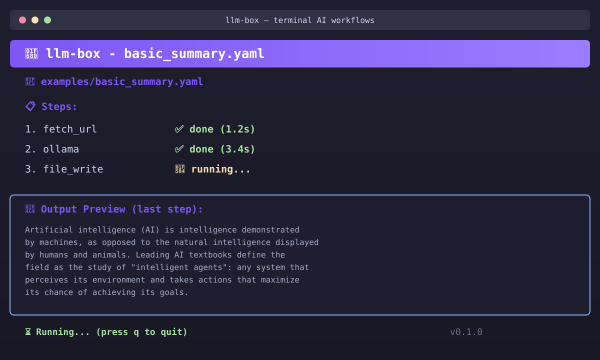

<div align="center">
  
  <h1>llm-box</h1>
  <p><strong>Build terminal workflows using plain English</strong></p>
<p>Describe what you want. llm-box generates the YAML and executes it.</p>

  <p>
    <a href="https://github.com/alib8b8/llm-box/releases">
      
    </a>
    <a href="https://golang.org/">
      
    </a>
    <a href="LICENSE">
      
    </a>
    <a href="https://github.com/alib8b8/llm-box/actions/workflows/release.yml">
      
    </a>
    <a href="https://goreportcard.com/report/github.com/alib8b8/llm-box">
      
    </a>
  </p>
</div>

---

## 🚀 Quick Start

Install in 60 seconds:

```bash
# Linux/macOS
curl -sL https://raw.githubusercontent.com/alib8b8/llm-box/main/install.sh | bash

# Windows
# Download from releases: https://github.com/alib8b8/llm-box/releases/latest
Invoke-WebRequest -Uri "https://github.com/alib8b8/llm-box/releases/latest/download/llm-box-windows-amd64.exe" -OutFile llm-box.exe
```

Create and run your first workflow:

```bash
# Create
llm-box create "fetch Hacker News top stories and save to stories.txt"

# Run
llm-box run hn_workflow.yaml
```

---

## 💡 Why Choose llm-box?

**Not Another AI Chatbot**

Most workflow tools force developers to choose between:

| Approach | Problem |
|----------|---------|
| Complex bash scripts | Hard to read, maintain, share |
| Heavy visual builders | Slow, opaque, require GUI |
| Endless config files | Steep learning curve, verbose syntax |

**llm-box is not an AI assistant — it's a deterministic execution engine.**

- ✅ **Predictable & Auditable** — Workflow steps are deterministic
- ✅ **Local-First** — Your data never leaves your terminal
- ✅ **Transparent & Reproducible** — Same workflow produces same results
- ✅ **MIT Open Source** — No vendor lock-in, no hidden barriers

> 💡 We use AI to understand your intent, but core execution runs on deterministic code.

---

## ✨ Features

- **Terminal First** - Native CLI, works anywhere you have a terminal
- **Plain English Workflows** - Define what you want, not how to do it
- **Single Binary** - Zero dependencies, install and run
- **Workflow Reusability** - Save, version, and share your workflows
- **Extensible Node System** - Build custom nodes in any language
- **MIT Licensed** - Open source, use freely
- **Cross Platform** - Linux, macOS, Windows supported
- **Beautiful TUI** - Real-time progress feedback

---

## 🔄 llm-box vs Alternatives

| Feature | llm-box | Dify/n8n | Claude Code | CrewAI |
|---------|---------|----------|-------------|--------|
| **Interface** | Terminal + YAML | Visual GUI | Chat | Code |
| **Execution** | Deterministic | AI-driven | AI autonomous | AI orchestration |
| **Setup** | 60 seconds | Hours | Minutes | Hours |
| **Transparency** | 100% | Medium | Low | Medium |
| **Reproducibility** | 100% | Variable | Variable | Variable |
| **Best For** | Automation | Enterprise apps | Coding | Research |

**Choose llm-box when you need:** repeatable, auditable workflows with AI assistance without losing control.

> 📖 [Full comparison →](docs/comparison.md)

---

## 🎬 Demo



> **Generate your own demo**
> Run `vhs docs/demo.tape` to create a high-quality GIF.

---

## 🔧 Architecture

```
┌─────────────────────────────────────────────────────────────┐
│                        User (Terminal)                      │
└─────────────────────────────────────────────────────────────┘
                             │
                             ▼
┌─────────────────────────────────────────────────────────────┐
│                  Natural Language Parser                   │
│            "Fetch HN stories and summarize"               │
└─────────────────────────────────────────────────────────────┘
                             │
                             ▼
┌─────────────────────────────────────────────────────────────┐
│                     Task Planner                           │
│         Convert intent into executable steps              │
└─────────────────────────────────────────────────────────────┘
                             │
                             ▼
┌─────────────────────────────────────────────────────────────┐
│                  Execution Engine                          │
│  ┌──────────┐ ┌───────────┐ ┌────────────┐ ┌───────────┐ │
│  │fetch_url │ │transform  │ │execute_cmd │ │file_write│ │
│  └──────────┘ └───────────┘ └────────────┘ └───────────┘ │
│  ┌──────────┐ ┌───────────┐ ┌────────────┐ ┌───────────┐ │
│  │ollama    │ │notify     │ │combine     │ │custom node│ │
│  └──────────┘ └───────────┘ └────────────┘ └───────────┘ │
└─────────────────────────────────────────────────────────────┘
                             │
                             ▼
┌─────────────────────────────────────────────────────────────┐
│                       Output                              │
│                 (Terminal / File / Notification)         │
└─────────────────────────────────────────────────────────────┘
```

**Components:**
1. **Parser** - Interprets plain English commands
2. **Planner** - Breaks down into steps
3. **Engine** - Executes with dependency management
4. **Nodes** - Built-in and extensible actions
5. **Output** - Formatted results

---

## 📚 10 Real Use Cases

### 1. Daily GitHub Summary

**Goal:** Get an overview of your activity

**Input:**
```bash
llm-box create "fetch my recent GitHub activity and save summary to github-digest.md"
```

**Workflow:**
```yaml
name: GitHub Daily Digest
steps:
  - node: fetch_url
    params:
      url: https://github.com/your-username
  - node: transform
    params:
      operation: extract_repos_and_activity
  - node: file_write
    params:
      path: github-digest.md
```

---

### 2. Research Assistant

**Goal:** Collect and summarize technical docs

**Input:**
```bash
llm-box create "fetch 3 tech blog posts about containerization and save key takeaways"
```

**Workflow:**
```yaml
name: Research Assistant
steps:
  - node: fetch_url
    params:
      url: https://example.com/blog1
  - node: fetch_url
    params:
      url: https://example.com/blog2
  - node: fetch_url
    params:
      url: https://example.com/blog3
  - node: transform
    params:
      operation: combine_and_summarize
  - node: file_write
    params:
      path: research-notes.md
```

---

### 3. Documentation Generator

**Goal:** Auto-generate API docs

**Input:**
```bash
llm-box create "scan my Go project and generate API overview"
```

**Workflow:**
```yaml
name: Docs Generator
steps:
  - node: execute
    params:
      command: find . -name "*.go"
  - node: transform
    params:
      operation: extract_functions_and_types
  - node: file_write
    params:
      path: API.md
```

---

### 4. Log Monitor

**Goal:** Watch logs and notify on errors

**Input:**
```bash
llm-box create "monitor server logs for 5xx errors and alert"
```

**Workflow:**
```yaml
name: Log Monitor
steps:
  - node: execute
    params:
      command: tail -n 100 /var/log/server.log
  - node: transform
    params:
      operation: filter_errors
  - node: notify
    params:
      channel: stdout
```

---

### 5. Release Notes Creator

**Goal:** Generate changelog from commits

**Input:**
```bash
llm-box create "turn git commit history into release notes"
```

**Workflow:**
```yaml
name: Release Notes Generator
steps:
  - node: execute
    params:
      command: git log --oneline --since="2 weeks ago"
  - node: transform
    params:
      operation: group_by_commit_type
  - node: file_write
    params:
      path: RELEASE-NOTES.md
```

---

### 6. Data Collector

**Goal:** Aggregate data from multiple APIs

**Input:**
```bash
llm-box create "fetch weather and stock data, combine into report"
```

**Workflow:**
```yaml
name: Daily Report Generator
steps:
  - node: fetch_url
    params:
      url: https://api.weather.gov/forecast
  - node: fetch_url
    params:
      url: https://api.stock.example.com/quote/ABC
  - node: combine
    params:
      format: markdown
  - node: file_write
    params:
      path: daily-report.md
```

---

### 7. File Organizer

**Goal:** Auto-sort downloads folder

**Input:**
```bash
llm-box create "organize downloads folder by file type"
```

**Workflow:**
```yaml
name: Downloads Organizer
steps:
  - node: execute
    params:
      command: ls -la ~/Downloads
  - node: transform
    params:
      operation: group_by_extension
  - node: execute
    params:
      command: mkdir -p ~/Downloads/images ~/Downloads/documents
  - node: execute
    params:
      command: mv ~/Downloads/*.jpg ~/Downloads/*.png ~/Downloads/images/
```

---

### 8. Content Workflow

**Goal:** Prepare posts for publishing

**Input:**
```bash
llm-box create "take markdown post and generate HTML version"
```

**Workflow:**
```yaml
name: Content Processor
steps:
  - node: fetch_url
    params:
      url: file://post.md
  - node: transform
    params:
      operation: markdown_to_html
  - node: file_write
    params:
      path: post.html
```

---

### 9. DevOps Automation

**Goal:** Deploy with health checks

**Input:**
```bash
llm-box create "build docker image and deploy with health check"
```

**Workflow:**
```yaml
name: Zero Downtime Deploy
steps:
  - node: execute
    params:
      command: docker build -t my-service .
  - node: execute
    params:
      command: docker-compose up -d --no-deps my-service
  - node: execute
    params:
      command: sleep 30 && curl -f http://localhost/health
  - node: notify
    params:
      channel: stdout
```

---

### 10. Team Reporting

**Goal:** Weekly team metrics

**Input:**
```bash
llm-box create "compile weekly issue and commit stats"
```

**Workflow:**
```yaml
name: Team Weekly Report
steps:
  - node: execute
    params:
      command: gh issue list --repo my-org/my-repo --since "1 week ago" --state all
  - node: transform
    params:
      operation: count_by_label
  - node: execute
    params:
      command: git log --author="@my-team.com" --since="1 week ago" --oneline
  - node: file_write
    params:
      path: team-report.md
```

---

## ❓ FAQ

### What makes this different from Bash scripts?
llm-box adds structure, reusability, and a beautiful UI without losing the power of the terminal.

### Do I have to write YAML?
No! Describe what you want in plain English, and llm-box generates the YAML for you.

### Can I extend it?
Yes! Build custom nodes in any language. See [docs/contributing.md](docs/contributing.md).

### Is it production-ready?
v0.1 is early access. v1.0 (stable) is planned for Q3 2026.

### Which platforms are supported?
Linux, macOS, and Windows are fully supported.

### Where can I get help?
Open a [GitHub Discussion](https://github.com/alib8b8/llm-box/discussions) or file an issue.

---

## 🗺️ Roadmap

### v0.1 - Initial Release ✓
- [x] Basic workflow creation
- [x] Execution engine
- [x] Built-in nodes (fetch_url, file_write, ollama)
- [x] Terminal UI

### v0.2 - Plugin System
- [ ] Plugin system for custom nodes
- [ ] Workflow template library
- [ ] Workflow sharing via URL

### v0.3 - Team Features
- [ ] Team workflow repository
- [ ] Workflow versioning
- [ ] Cloud sync (optional)

### v0.4 - Enterprise
- [ ] Access control
- [ ] Audit logging
- [ ] Scheduled workflows

### v1.0 - Stable
- [ ] Production readiness
- [ ] Comprehensive docs
- [ ] Long-term support

---

## 🤝 Contributing

We welcome contributors of all skill levels!

### Ways to Contribute
- **Go Developers** - Build new nodes, improve core
- **Documentation** - Improve docs, write tutorials
- **Workflow Designers** - Share your workflows
- **Community Builders** - Help others on Discussions

### Quick Start

```bash
git clone https://github.com/alib8b8/llm-box.git
cd llm-box
go mod download
go test ./...
go build -o llm-box ./cmd/llm-box
./llm-box help
```

See [docs/contributing.md](docs/contributing.md) for guidelines.

---

## 📄 License

MIT License - see [LICENSE](LICENSE) for full details.

---

<div align="center">
  <p>If this project helps you, please give it a ⭐</p>
  <p>
    <a href="https://github.com/alib8b8/llm-box/stargazers">
      
    </a>
  </p>
</div>
