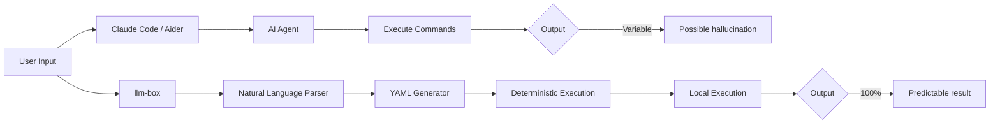

# llm-box vs Alternatives

A comprehensive comparison of llm-box with other workflow automation and AI tools.

## Overview

llm-box is a **deterministic workflow execution engine** that uses AI to understand natural language intent but executes workflows through reliable, auditable code. This positioning differentiates it from both heavyweight AI platforms and AI-first coding assistants.

## Comparison Matrix

### Visual/Low-Code AI Platforms

| Feature | Dify | n8n | Flowise | llm-box |
|---------|------|-----|---------|---------|
| **GitHub Stars** | 142k | 190k | 51k | Early stage |
| **Interface** | Visual drag-drop | Visual drag-drop | Visual drag-drop | **Terminal + YAML** |
| **Deployment** | Docker/Cloud | Docker/Cloud | Docker/Cloud | **Single binary** |
| **Complexity** | High | High | Medium | **Low** |
| **Learning Curve** | Steep | Medium | Medium | **Gentle** |
| **AI Dependency** | Core feature | Secondary | Core feature | **Optional** |
| **Execution Model** | AI-driven | Event-driven | AI-driven | **Deterministic** |
| **Setup Time** | Hours | Hours | Hours | **60 seconds** |

### Terminal AI Tools

| Feature | Claude Code | Aider | OpenCode | llm-box |
|---------|-------------|-------|----------|---------|
| **GitHub Stars** | N/A (Official) | 40k | 103k | Early stage |
| **Primary Use** | Code development | Pair programming | Multi-model CLI | **Workflow automation** |
| **Execution Model** | AI autonomous | AI autonomous | AI autonomous | **Deterministic** |
| **Transparency** | Black box | Black box | Black box | **Fully auditable** |
| **Reproducibility** | Variable | Variable | Variable | **100% deterministic** |
| **Output** | Code changes | Code changes | Code changes | **Executable workflows** |
| **Model Lock-in** | Claude only | 75+ models | 75+ models | **Local Ollama** |

### Multi-Agent Frameworks

| Feature | CrewAI | AutoGen | LangGraph | llm-box |
|---------|--------|---------|-----------|---------|
| **GitHub Stars** | 44k | 54k | 29k | Early stage |
| **Architecture** | Role-based agents | Conversational agents | Graph state machine | **Node-based executor** |
| **Complexity** | Medium | High | High | **Low** |
| **Best For** | Research teams | Complex reasoning | Precise control | **Automation tasks** |
| **Execution Model** | AI orchestration | AI conversation | AI state machine | **Deterministic** |

## Philosophy: Why Deterministic Matters

### The LeCun Perspective

Yann LeCun's six core critiques of current AI approaches directly inform llm-box's design:

| LeCun's Point | llm-box's Response |
|---------------|-------------------|
| "LLMs are inherently unsafe" | **AI only for understanding intent; execution is deterministic code** |
| "Hallucination is baked in" | **YAML workflows are 100% reproducible** |
| "Big tech creates barriers" | **MIT license, single binary, no vendor lock-in** |
| "Herd mentality stifles innovation" | **Minimalist, focused approach vs. feature bloat** |
| "Don't research LLMs" | **AI is a tool, not the core product** |
| "Predictive architectures needed" | **YAML defines exact execution path** |

### Comparison with AI Chatbots

## Target Users

| User Type | Other Tools | llm-box Advantage |
|-----------|-------------|-------------------|
| **Enterprise IT** | Dify, n8n | Not competing |
| **AI Researchers** | LangGraph, AutoGen | Not competing |
| **Developers (coding)** | Claude Code, Aider | Partial overlap |
| **DevOps/Automation** | Bash scripts (hard to maintain) | **Core target!** |
| **Privacy-sensitive users** | Cloud solutions | **Strong need!** |
| **Complexity-averse users** | Heavy frameworks | **Blue ocean!** |

## Market Gap Analysis

| Need | Current Solution | llm-box Opportunity |
|------|-----------------|-------------------|
| Simple workflow automation | Bash scripts (unmaintainable) | ✅ Modern alternative |
| AI assistance without losing control | Claude Code (too AI) | ✅ Balance point |
| Local-first privacy | Dify (requires deployment) | ✅ Single binary |
| Response to LeCun's criticism | None | ✅ Market gap |

## Positioning Statement

> **"When you want to execute a deterministic, reproducible workflow, choose llm-box.**
> **When you want AI to make decisions for you, choose Claude Code."**

### Key Differentiators

1. **Deterministic Execution** - YAML declaration → 100% reproducible
2. **Local-First** - Single binary, no dependencies, data never leaves terminal
3. **Minimalist** - 60-second install, single-command usage
4. **Transparent & Auditable** - Viewing YAML = seeing execution plan
5. **LeCun-Friendly** - Embraces AI safety concerns

## Competitive Advantages Summary

| Advantage | llm-box | Dify | Claude Code | CrewAI |
|-----------|---------|------|-------------|--------|
| Setup time | 60s | Hours | Minutes | Hours |
| Binary size | <20MB | Requires Docker | Requires install | Requires Python |
| AI dependency | Optional | Required | Required | Required |
| Execution model | Deterministic | AI-driven | AI autonomous | AI orchestration |
| Transparency | 100% | Medium | Low | Medium |
| Reproducibility | 100% | Variable | Variable | Variable |

## When to Choose llm-box

✅ **Choose llm-box when:**
- You need repeatable, auditable workflows
- Privacy is paramount (data stays local)
- You prefer terminal over GUI
- You want AI assistance without losing control
- You're automating DevOps or data pipelines

❌ **Choose alternatives when:**
- You need visual workflow design (→ Dify, n8n)
- You need complex multi-agent research (→ CrewAI, AutoGen)
- You're doing code development (→ Claude Code, Aider)
- You need enterprise integrations (→ n8n, Dify)

## Related Reading

- [Architecture](architecture.md) - Technical design
- [Getting Started](getting-started.md) - Quick start guide
- [Examples](../examples/) - Workflow examples
- [Roadmap](roadmap.md) - Future development

---

*Last updated: 2026-06-08*
