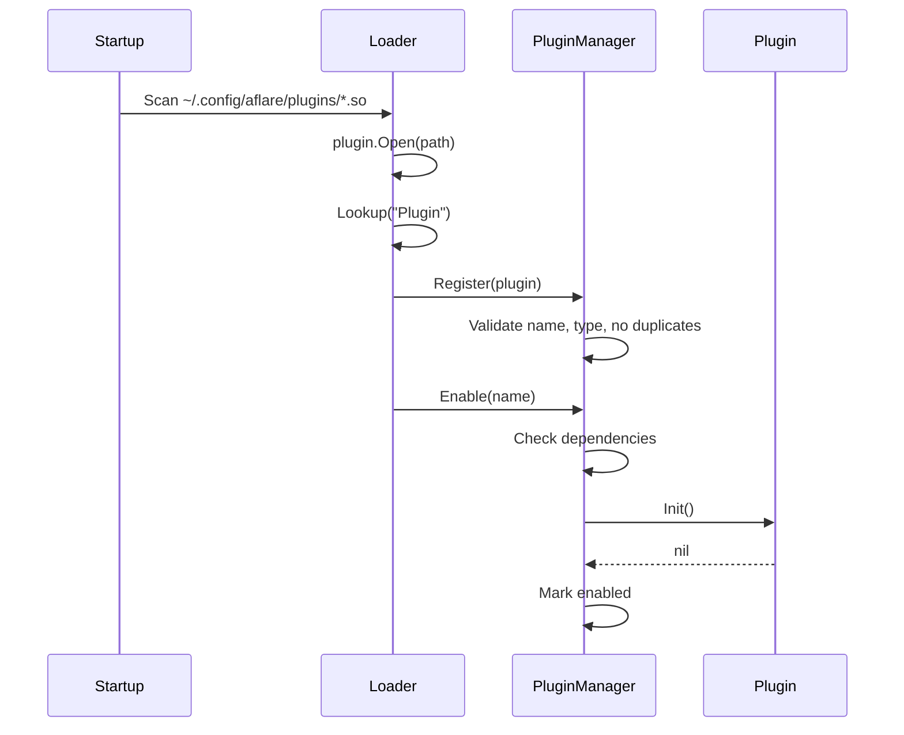

# Plugin Development Guide

aflare supports loading community-contributed plugins as Go `.so` files. Plugins can add custom
nodes to the workflow engine or extend core functionality — without modifying the aflare source code.

> **Platform support**: Go plugins (`-buildmode=plugin`) are only available on **Linux** and **macOS**.
> The `plugin` package is not supported on Windows. If you need cross-platform extensibility,
> consider using aflare's built-in MCP server support or contributing a built-in node instead.

## Architecture

```
~/.config/aflare/plugins/
├── my-node-plugin.so        # Go plugin: exports "Plugin" symbol
├── db-connector.so          # Another custom node plugin
└── custom-auth.so           # Extension plugin
```

At startup, aflare scans `~/.config/aflare/plugins/*.so`, opens each shared object, and registers
the exported `Plugin` symbol with the `PluginManager`. Each plugin is then enabled (initialized)
after dependency checks pass.

## Plugin Interface

Every plugin must implement the `plugins.Plugin` interface:

```go
// internal/plugins/plugin.go

type PluginInfo struct {
    Name         string
    Version      string
    Description  string
    Author       string
    Type         string   // "node" or "extension"
    Dependencies []string
}

type Plugin interface {
    GetInfo()  PluginInfo
    Init()     error
    Shutdown() error
}
```

For node-type plugins, also implement the `NodePlugin` interface:

```go
type NodePlugin interface {
    Plugin
    GetNodes() []interface{}  // returns node names this plugin provides
}
```

## Writing a Plugin

### Step 1: Create the plugin package

Create a new Go module for your plugin:

```
my-plugin/
├── go.mod
└── main.go
```

### Step 2: Implement the Plugin interface

```go
package main

import (
    "github.com/alib8b8/aflare/internal/plugins"
    "github.com/alib8b8/aflare/internal/core"
)

// Plugin is the exported symbol that aflare discovers.
// The name MUST be "Plugin" and its type MUST implement plugins.Plugin.
var Plugin = &MyNodePlugin{
    info: plugins.PluginInfo{
        Name:        "my-custom-node",
        Version:     "1.0.0",
        Description: "Adds a custom weather lookup node to aflare",
        Author:      "Your Name",
        Type:        plugins.PluginTypeNode,
        Dependencies: []string{},   // optional: list plugin names this depends on
    },
}

type MyNodePlugin struct {
    info plugins.PluginInfo
    reg  *core.Registry
}

func (p *MyNodePlugin) GetInfo() plugins.PluginInfo {
    return p.info
}

func (p *MyNodePlugin) Init() error {
    // Register your custom nodes with the global registry.
    // core.RegisterNode("weather_lookup", &WeatherNode{})
    return nil
}

func (p *MyNodePlugin) Shutdown() error {
    // Cleanup resources (close connections, flush buffers, etc.)
    return nil
}

func (p *MyNodePlugin) GetNodes() []interface{} {
    return []interface{}{"weather_lookup"}
}
```

### Step 3: Build the .so file

```bash
cd my-plugin
go build -buildmode=plugin -o my-custom-node.so .
```

### Step 4: Install

```bash
mkdir -p ~/.config/aflare/plugins
cp my-custom-node.so ~/.config/aflare/plugins/
```

Restart aflare. The plugin loads automatically at startup.

## Plugin Lifecycle



1. **Register** — Plugin is added to the manager and validated.
2. **Enable** — Dependencies are checked; if all are satisfied, `Init()` is called.
3. **Execute** — Plugin nodes are available in workflows.
4. **Disable** — `Shutdown()` is called and the plugin is removed from the active set.
5. **Unregister** — Plugin is completely removed from the manager.

## Dependency Management

If your plugin depends on another plugin, list it in `PluginInfo.Dependencies`:

```go
var Plugin = &MyAdvancedPlugin{
    info: plugins.PluginInfo{
        Name:         "my-advanced-plugin",
        Type:         plugins.PluginTypeNode,
        Dependencies: []string{"my-custom-node"},
    },
}
```

The dependency plugin must be:
- **Registered** — present in the plugin manager
- **Enabled** — already initialized before the dependent plugin

If a dependency is missing or disabled, `Enable()` returns an error.

## Built-in Example Plugins

The `internal/plugins/plugin.go` file includes two reference implementations:

### EchoPlugin

A simple node plugin that provides an `echo_node`:

```go
func (e *EchoPlugin) GetNodes() []interface{} {
    return []interface{}{"echo_node"}
}
```

### ReversePlugin

A node plugin that depends on `echo`:

```go
func NewReversePlugin() *ReversePlugin {
    return &ReversePlugin{
        info: PluginInfo{
            Name:         "reverse",
            Type:         PluginTypeNode,
            Dependencies: []string{"echo"},
        },
    }
}
```

## Startup Integration

In `cmd/aflare/main.go`, plugins are loaded during startup:

```go
pluginMgr := plugins.NewPluginManager()
if n, err := plugins.LoadDir(plugins.DefaultPluginDir(), pluginMgr); err != nil {
    log.Printf("[main] plugin loading: %v", err)
} else if n > 0 {
    log.Printf("[main] loaded %d plugin(s)", n)
}
```

The default plugin directory is `~/.config/aflare/plugins/`. Non-`.so` files and directories
are silently skipped.

## Plugin Types

| Type | Description | When to use |
|------|-------------|-------------|
| `node` | Adds new workflow nodes | Custom LLM providers, database connectors, API integrations |
| `extension` | Extends core functionality | Custom authentication, logging, metrics |

## Security Considerations

1. **Trust the source** — `.so` plugins run in-process with the same privileges as aflare.
   Only install plugins from trusted sources.
2. **Review the code** — Go plugins have full access to the process memory and file system.
3. **No sandbox** — Plugins are not isolated; a buggy plugin can crash the entire process.
4. **Sensitive data** — Do not hard-code API keys or credentials in plugin code; use aflare's
   configuration system instead.

## Best Practices

1. **Version your plugins** — Use semantic versioning in `PluginInfo.Version`.
2. **Keep `Init()` lightweight** — Heavy initialization delays startup; consider lazy loading.
3. **Clean up in `Shutdown()`** — Close connections, stop goroutines, flush buffers.
4. **Handle errors gracefully** — Return meaningful errors from `Init()` and `Shutdown()`.
5. **Name your export `Plugin`** — The loader looks for the symbol named `Plugin` with the
   exact `plugins.Plugin` interface type.
6. **Match the aflare build** — Plugins must be compiled with the same Go version and
   dependency versions as the aflare binary they target.

## Troubleshooting

### Plugin not loading at startup

- Check the plugin file has `.so` extension
- Verify it's in `~/.config/aflare/plugins/`
- Check the startup log for `[plugins]` or `[main]` messages

### "lookup Plugin symbol" error

The `.so` file must export a package-level variable named `Plugin`:

```go
var Plugin plugins.Plugin = &MyPlugin{}
```

### "does not implement plugins.Plugin" error

The exported symbol's type must match the `plugins.Plugin` interface exactly. Ensure both
your plugin and aflare are compiled with the same `plugins` package (same import path).

### Build errors

Plugins must be built with the same Go toolchain version as aflare:

```bash
go version
go build -buildmode=plugin -o myplugin.so .
```

### Windows: "plugin" package not available

Go's `plugin` package is not available on Windows. If you see `plugin: not implemented on
windows/amd64`, you are running on an unsupported platform. Use Linux or macOS for plugin
development, or use aflare's MCP server support for cross-platform extensibility.

## Current Status

aflare ships with 100+ built-in nodes covering most use cases. The plugin system is available
for community extensions, but the built-in set is sufficient for most users. Consider
contributing a plugin when:

- You need a custom LLM provider not yet supported
- You want to integrate with an internal/proprietary API
- You have a domain-specific node that benefits the broader community