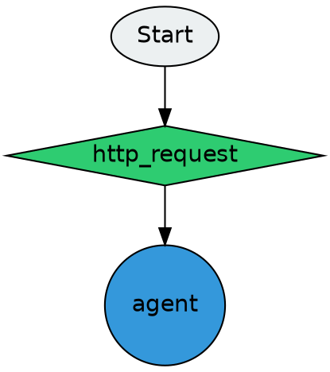
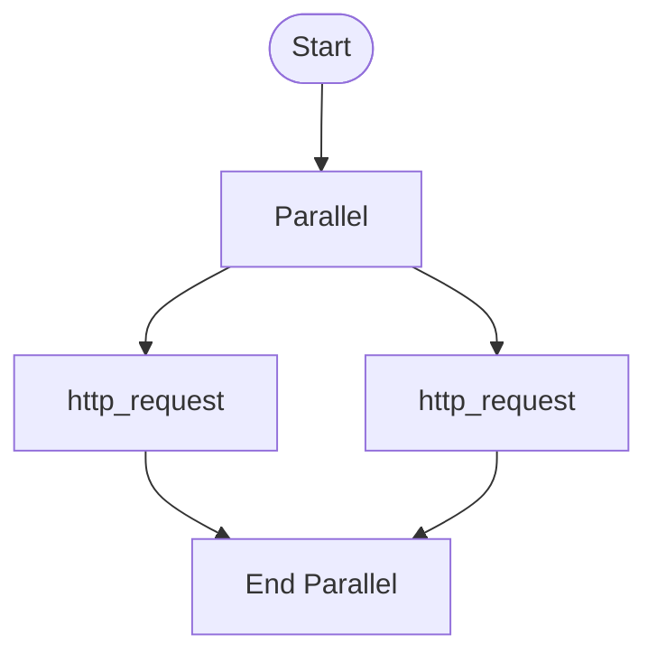
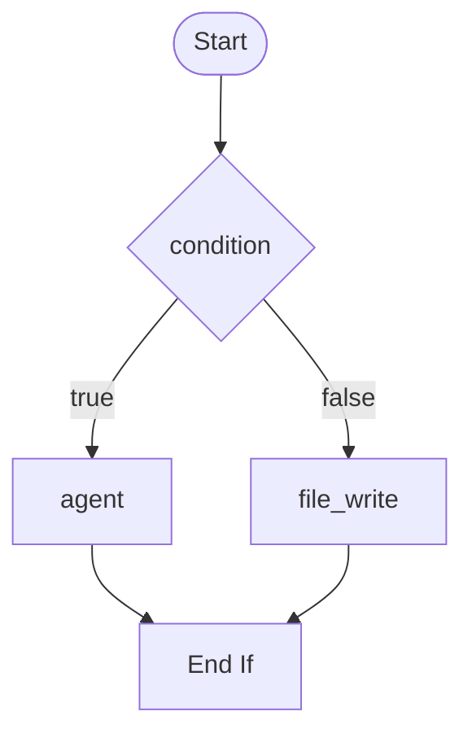
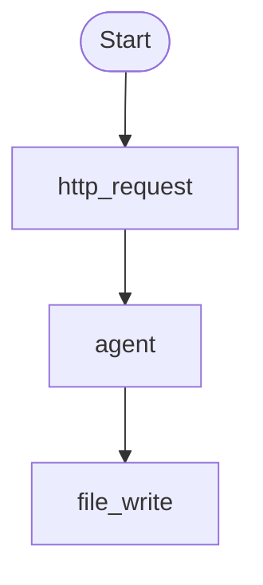

# Workflow Visualizer

aflare can generate visual diagrams from workflow YAML files in multiple formats.

## Quick Start

### CLI Usage

```bash
# Generate Mermaid diagram
aflare visualize workflow.yaml

# Generate specific format
aflare visualize workflow.yaml --format mermaid
aflare visualize workflow.yaml --format dot
aflare visualize workflow.yaml --format ascii
aflare visualize workflow.yaml --format json

# Output to file
aflare visualize workflow.yaml -o diagram.md
aflare visualize workflow.yaml --format dot -o diagram.dot
```

### Programmatic Usage

```go
import "github.com/alib8b8/aflare/internal/visualizer"

// Generate Mermaid diagram
mermaid := visualizer.GenerateMermaid(yamlContent)

// Generate with custom direction (LR = left-to-right)
mermaidLR := visualizer.GenerateMermaidWithDirection(yamlContent, "LR")

// Generate DOT format
dot := visualizer.GenerateDOT(yamlContent)

// Generate ASCII art
ascii := visualizer.GenerateASCII(yamlContent)

// Generate JSON for custom rendering
jsonData := visualizer.GenerateJSON(yamlContent)
```

## Supported Formats

### Mermaid

Mermaid is the default format, generating interactive flowchart diagrams:


**Features**:
- Interactive nodes (hover, click)
- Zoom and pan support
- Different shapes for different node types
- Subgraphs for parallel steps

### DOT (Graphviz)

Generate Graphviz DOT format for advanced diagramming:



**Render with Graphviz**:
```bash
dot -Tpng diagram.dot -o diagram.png
dot -Tsvg diagram.dot -o diagram.svg
```

### ASCII

Generate simple text-based diagrams:

```
+--------+
| Start  |
+--------+
+------------------+
| http_request     |
+------------------+
    |
    v
+--------+
| agent  |
+--------+
    |
    v
+------------+
| file_write |
+------------+
```

**Use cases**:
- Terminal output
- Documentation without images
- Quick workflow overview

### JSON

Generate structured JSON data for custom frontend rendering:

```json
{
  "nodes": [
    {"id": "start", "type": "start", "label": "Start", "x": 0, "y": 0, "color": "#ecf0f1", "shape": "ellipse"},
    {"id": "http_request_1", "type": "http_request", "label": "http_request", "x": 150, "y": 100, "color": "#2ecc71", "shape": "diamond"}
  ],
  "edges": [
    {"from": "start", "to": "http_request_1", "label": "", "style": "solid"}
  ],
  "metadata": {"name": "test", "description": "", "step_count": 3}
}
```

## Node Styling

Different node types are rendered with different colors and shapes:

| Node Type | Color | Shape |
|-----------|-------|-------|
| LLM nodes (openai, ollama, etc.) | `#3498db` (blue) | Circle |
| execute | `#e74c3c` (red) | Rectangle |
| http_request, fetch_url | `#2ecc71` (green) | Diamond |
| condition, if | `#f1c40f` (yellow) | Diamond |
| file_read, file_write | `#95a5a6` (gray) | Cylinder |
| Default | `#ffffff` (white) | Rectangle |

## Advanced Usage

### Custom Direction

```bash
# Left-to-right layout
aflare visualize workflow.yaml --format mermaid --direction LR

# Top-to-bottom (default)
aflare visualize workflow.yaml --format mermaid --direction TD
```

### Parallel Steps

Parallel steps are rendered as subgraphs:



### Conditional Steps

If/else conditions are rendered with diamond decision nodes:



## Examples

### Simple Workflow

**Input YAML**:
```yaml
name: simple-pipeline
steps:
  - node: http_request
    params:
      url: "https://api.example.com/data"
  - node: agent
    params:
      model: gpt-4o
  - node: file_write
    params:
      path: output.txt
```

**Output Mermaid**:


### Complex Workflow with Branches

```yaml
name: complex-workflow
steps:
  - node: http_request
    id: fetch_data
  - node: condition
    params:
      condition: "{{input}} contains 'error'"
    id: check_error
  - if: "{{step.check_error}}"
    steps:
      - node: agent
        params:
          model: gpt-4o
          prompt: "Fix this error: {{input}}"
    else:
      - node: file_write
        params:
          path: success.log
```

## Tips

1. **Keep Workflows Simple**: Complex nested workflows can produce cluttered diagrams
2. **Use Descriptive IDs**: Named steps produce clearer labels
3. **Preview Early**: Visualize your workflow as you build it
4. **Export Formats**: Use Mermaid for documentation, DOT for high-quality images

## Integration

### Embed in Markdown

```markdown
```mermaid
{{#aflare visualize workflow.yaml --format mermaid}}
```
```

### CI/CD Integration

```yaml
# GitHub Actions
- name: Generate diagram
  run: aflare visualize workflow.yaml -o docs/diagram.md
```
