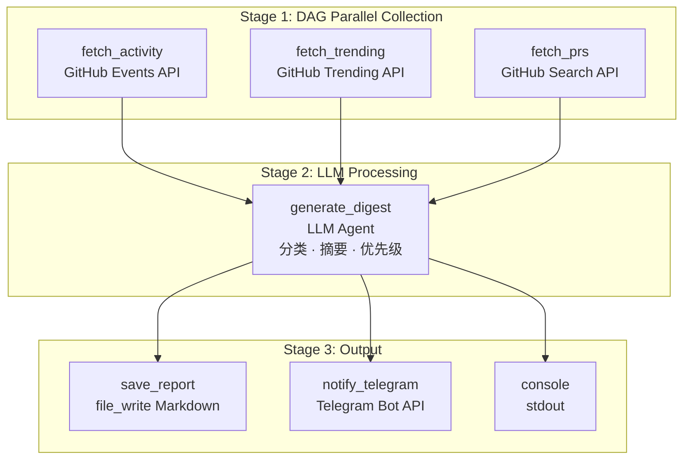

# GitHub Daily Digest — Killer Demo

> 个人自动化场景：每天早上一键获取 GitHub 动态摘要，LLM 智能整理后推送到 Telegram。

一个展示 aflare 核心能力的端到端示例：**DAG 并行执行、LLM Agent 摘要、Telegram 通知、定时调度**。

---

## 它能做什么

每天早上 8:00，aflare 自动执行：

| 任务 | 数据源 | 方式 |
|------|--------|------|
| 👤 个人动态 | GitHub Events API | HTTP 请求获取 Push/PR/Issue/Star/Release |
| 🔥 Trending 仓库 | 模拟 Trending API | 今日最热开源项目 |
| 📋 PR/Issue 状态 | GitHub Search API | 待处理的 PR 和 Issue |

三项数据**并行采集**（DAG），完成后由 LLM Agent 生成结构化日报，保存为 Markdown，并通过 Telegram 推送。

### 预期输出示例

```markdown
# 📊 GitHub Daily Digest — 2026-08-09

## 👤 Your Activity
| Type | Repository | Detail |
|------|-----------|--------|
| 🔀 PR | api-gateway | **Add rate limiting middleware** — opened, needs review |
| 📤 Push | awesome-project | 2 commits: feat + fix |
| 🐛 Issue | cli-tool | Support custom config path — good first issue |
| ⭐ Star | torvalds/linux | Starred |
| 🚀 Release | awesome-project | v2.1.0 released |

## 🔥 Trending Repositories
| Repository | Stars | Language | Why |
|-----------|-------|----------|-----|
| anthropics/claude-code | 25.6k | TypeScript | AI coding agent, +1203 today |
| tursodatabase/limbo | 11.2k | Rust | SQLite rewrite in Rust, +891 today |
| astral-sh/uv | 45.2k | Rust | Fast Python package manager, +678 today |

## 📋 Open PRs & Issues
1. **api-gateway#42** — Add rate limiting middleware 🟡 needs review
2. **awesome-project#87** — Refactor database layer 🔴 changes requested
3. **cli-tool#128** — Support custom config path 🟢 good first issue

## 📌 Today's Focus
1. [ ] Review PR #42 (api-gateway rate limiting)
2. [ ] Address review comments on PR #87 (database refactor)
3. [ ] Check out tursodatabase/limbo — trending SQLite rewrite
```

---

## 运行截图

### Mock 服务启动

```console
$ cd examples/killer-demos/04-github-daily-digest
$ python3 mock-server.py

============================================================
  🐙  Mock GitHub + Telegram API — GitHub Daily Digest Demo
============================================================
  Listening on http://0.0.0.0:17902

  GitHub Endpoints:
    GET /users/{username}/events  — 用户动态
    GET /trending                 — Trending 仓库
    GET /search/issues            — 搜索 Issue/PR
    GET /health                   — 健康检查

  Telegram Endpoints:
    POST /bot{token}/sendMessage  — 发送消息
============================================================
```

### API 数据验证

```console
$ curl -s http://localhost:17902/users/your-username/events | python3 -m json.tool | head -30
[
    {
        "id": "1",
        "type": "PushEvent",
        "repo": {
            "name": "your-username/awesome-project",
            "url": "https://github.com/your-username/awesome-project"
        },
        "payload": {
            "commits": [
                { "message": "feat: add real-time notification system" },
                { "message": "fix: resolve race condition in worker pool" }
            ]
        },
        "created_at": "2026-08-09T08:30:00Z"
    },
    ...
]

$ curl -s http://localhost:17902/trending | python3 -c "
import sys,json; d=json.load(sys.stdin)
[r['name'] for r in d[:5]]
"
microsoft/garnet (C#) 12340★ +342
exo-lang/exo (Rust) 8920★ +567
anthropics/claude-code (TypeScript) 25600★ +1203
vercel/ai (TypeScript) 18900★ +234
tursodatabase/limbo (Rust) 11200★ +891
```

### 工作流运行

```console
$ aflare run workflow.yaml

[collect_data] Parallel execution started (3 branches)
[fetch_activity] GET /users/your-username/events → 200 OK (7 events)
[fetch_trending]  GET /trending → 200 OK (7 repos)
[fetch_prs]       GET /search/issues → 200 OK (3 items)
[collect_data] All 3 branches completed

[generate_digest] LLM agent processing...
[generate_digest] Generated digest (1,234 tokens)

[save_report] Written to github-digest.md
[notify_telegram] Message sent to Telegram
[console] ✅ GitHub Daily Digest complete!

$ cat github-digest.md
# 📊 GitHub Daily Digest — 2026-08-09

## 👤 Your Activity
| Type | Repository | Detail |
|------|-----------|--------|
| 🔀 PR | api-gateway | Add rate limiting middleware — needs review |
| 📤 Push | awesome-project | 2 commits: feat + fix |
...
```

---

## 快速开始

### 1. 安装 aflare

```bash
curl -sL https://raw.githubusercontent.com/alib8b8/aflare/main/install.sh | bash
aflare --help
```

### 2. 启动 Mock 服务

Mock 服务模拟 GitHub API 和 Telegram API，无需真实密钥即可运行：

```bash
cd examples/killer-demos/04-github-daily-digest
python3 mock-server.py
# 输出: [mock] Listening on http://0.0.0.0:17902
```

### 3. 配置 LLM

```bash
# 使用 OpenAI
export OPENAI_API_KEY="sk-..."

# 或使用 DeepSeek（国内推荐）
# 编辑 workflow.yaml 将 vars.provider 改为 deepseek
export DEEPSEEK_API_KEY="sk-..."

# 或使用本地 Ollama
# 编辑 workflow.yaml 将 vars.provider 改为 ollama
```

### 4. 运行工作流

```bash
# 立即运行一次
aflare run workflow.yaml

# 设置每天 8:00 自动运行
aflare schedule --cron "0 8 * * *" workflow.yaml

# 查看定时任务
aflare schedule --list
```

### 5. 查看输出

```bash
cat github-digest.md
```

---

## 工作流架构



### 核心设计要点

| 特性 | 实现方式 |
|------|----------|
| **DAG 并行** | `parallel` 步骤，三路并发采集数据 |
| **容错降级** | `continue_on_error: true` — 单路失败不影响整体 |
| **重试策略** | `retry` + `backoff`（指数退避），API 重试 2 次 |
| **LLM Agent** | `agent` 节点启用 thinking 模式，自动分类、摘要 |
| **多通道输出** | `file_write` 保存 Markdown + `notify` 推送到 Telegram + stdout |
| **定时调度** | `aflare schedule --cron "0 8 * * *"` 每天自动运行 |

---

## 自定义配置

### 更换 LLM 提供商

编辑 `workflow.yaml` 中的 `vars` 部分：

```yaml
# 使用 DeepSeek（国内推荐）
provider: deepseek
model: deepseek-chat

# 使用本地 Ollama
provider: ollama
model: llama3

# 使用 Qwen
provider: qwen
model: qwen-max
```

### 使用真实 GitHub API

```yaml
# 修改 workflow.yaml
github_api_url: "https://api.github.com"
github_token: "{{secret.github.token}}"
```

```bash
# 配置 GitHub Token
aflare secrets set github.token "ghp_xxxxxxxxxxxx"
```

### 配置 Telegram 通知

```bash
aflare secrets set telegram.token "123456:ABC-DEF1234ghikl"
aflare secrets set telegram.chat_id "123456789"
```

### 调整定时策略

```bash
# 工作日早上 8:00
aflare schedule --cron "0 8 * * 1-5" workflow.yaml

# 每天 8:00 和 18:00
aflare schedule --cron "0 8,18 * * *" workflow.yaml
```

---

## 文件结构

```
04-github-daily-digest/
├── workflow.yaml      # 工作流定义（核心）
├── mock-server.py     # Mock GitHub + Telegram API
├── README.md          # 本文档
└── github-digest.md   # 生成的日报（运行后自动创建）
```

---

## 相关资源

- [aflare 文档](https://github.com/alib8b8/aflare)
- [节点参考](https://github.com/alib8b8/aflare/blob/main/docs/nodes-reference.md)
- [定时调度指南](https://github.com/alib8b8/aflare/blob/main/docs/scheduling.md)
- [02-financial-workflow](../02-financial-workflow/) — 企业金融 Saga 事务
- [05-code-review-pipeline](../05-code-review-pipeline/) — 代码审查流水线