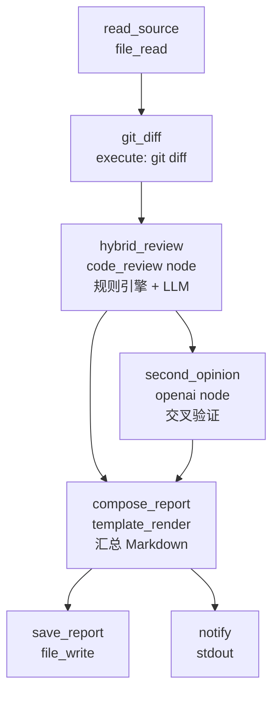

# Code Review Pipeline — Killer Demo

> 开发者工具场景：git diff → 多 LLM 交叉审查 → 汇总报告，一键完成代码审查。

展示 aflare 在开发者工具场景的核心能力：**code_review 混合审查、多 LLM 交叉验证、规则引擎 + AI 双保险**。

---

## 它能做什么

提交代码前，一键运行多模型交叉审查：

| 阶段 | 工具 | 检查内容 |
|------|------|----------|
| 🔍 规则引擎 | 确定性规则 | NPE、线程安全、硬编码密钥、资源泄漏 |
| 🤖 主 LLM 审查 | LLM 深度分析 | 逻辑缺陷、性能隐患、可维护性、安全漏洞 |
| 🧐 第二意见 | 另一个 LLM | 交叉验证、标记误报、补充遗漏 |

结果汇总为结构化 Markdown 报告，每个发现标注严重级别和确认状态。

### 预期输出示例

```markdown
# Code Review Report

**Target file:** `mock-source.go`
**Language:** go · **Focus:** all · **Min Severity:** medium
**Primary:** ollama/llama3 · **Second Opinion:** ollama/llama3

---

## 📊 Review Summary

| Metric | Value |
|--------|-------|
| File | `mock-source.go` |
| Review Method | Rules Engine + LLM + Second Opinion |

---

## 🔍 Primary Review (Rules + LLM)

### 🔴 Critical
- **Line 42**: Possible nil pointer dereference — `resp.Body` accessed without nil check
- **Line 87**: Hardcoded API key — `apiKey := "sk-test-12345"`

### 🟡 High
- **Line 56**: Missing context propagation
- **Line 128**: Race condition in `counter` variable

### 🟢 Medium
- **Line 15**: Error ignored — `json.Unmarshal` return value not checked
...

## 🧐 Second Opinion

### CONFIRMED
- **Line 42 (nil pointer dereference)**: CONFIRMED. Real bug.

### DISPUTED
- **Line 73 (large allocation)**: DISPUTED. Premature optimization.

### MISSED
- **Line 34**: Missing `defer resp.Body.Close()` — resource leak.
```

---

## 运行截图

### Mock 服务启动

```console
$ cd examples/killer-demos/05-code-review-pipeline
$ python3 mock-server.py

============================================================
  🤖  Mock LLM API — Code Review Pipeline Demo
============================================================
[mock] created sample source file: mock-source.go
  Listening on http://0.0.0.0:17903

  Endpoints:
    POST /v1/chat/completions  — Chat Completion（返回审查结果）
    GET  /health               — 健康检查

  Sample source file:
    mock-source.go             — 包含故意引入的 bug 的示例代码
============================================================
```

### API 审查结果验证

```console
$ curl -s -X POST http://localhost:17903/v1/chat/completions \
  -H 'Content-Type: application/json' \
  -d '{"model":"gpt-4o","messages":[{"role":"user","content":"review this code"}]}' \
  | python3 -c "import sys,json; d=json.load(sys.stdin); print(d['choices'][0]['message']['content'])"

## Issues Found

### 🔴 Critical
- **Line 42**: Possible nil pointer dereference — `resp.Body` accessed without nil check
- **Line 87**: Hardcoded API key — `apiKey := "sk-test-12345"`

### 🟡 High
- **Line 56**: Missing context propagation
- **Line 128**: Race condition in `counter` variable

### 🟢 Medium
- **Line 15**: Error ignored — `json.Unmarshal` return value not checked
- **Line 73**: Large allocation in hot path

### 📊 Summary
- **Total issues**: 8
- **Critical**: 2 | **High**: 2 | **Medium**: 2 | **Low**: 2
```

### 工作流运行

```console
$ aflare run workflow.yaml

[read_source] Reading mock-source.go (299 bytes)
[git_diff] No diff available — reviewing entire file

[hybrid_review] Rules engine: 8 issues found (2 critical, 2 high, 2 medium, 2 low)
[hybrid_review] LLM analysis: 8 issues found

[second_opinion] Cross-validation: 3 confirmed, 1 disputed, 2 missed
[compose_report] Report generated

[save_report] Written to code-review-report.md
[notify] ✅ Code Review Complete!

$ cat code-review-report.md
# Code Review Report

**Target file:** `mock-source.go`
**Primary:** ollama/llama3 · **Second Opinion:** ollama/llama3

## 🔍 Primary Review (Rules + LLM)

### 🔴 Critical
- **Line 42**: Possible nil pointer dereference
- **Line 87**: Hardcoded API key

### 🟡 High
- **Line 56**: Missing context propagation
- **Line 128**: Race condition in `counter` variable

## 🧐 Second Opinion

### CONFIRMED
- **Line 42 (nil pointer)**: CONFIRMED
- **Line 87 (hardcoded key)**: CONFIRMED

### DISPUTED
- **Line 73 (large allocation)**: DISPUTED

### MISSED
- **Line 34**: Missing `defer resp.Body.Close()`
```

---

## 快速开始

### 1. 安装 aflare

```bash
curl -sL https://raw.githubusercontent.com/alib8b8/aflare/main/install.sh | bash
```

### 2. 启动 Mock LLM 服务

Mock 服务自动生成包含故意 bug 的示例源文件，并模拟 LLM API 返回审查结果：

```bash
cd examples/killer-demos/05-code-review-pipeline
python3 mock-server.py
# 输出: [mock-llm] Listening on http://0.0.0.0:17903
# 自动创建: mock-source.go（包含 8 个故意引入的 bug）
```

### 3. 配置 LLM

```bash
# 使用 Mock 服务（无需真实 API Key）
export OPENAI_API_KEY="mock"
export OPENAI_BASE_URL="http://localhost:17903/v1"

# 或使用真实 LLM
export OPENAI_API_KEY="sk-..."
# 编辑 workflow.yaml 修改 provider 和 model
```

### 4. 运行工作流

```bash
# 审查 mock-source.go（默认）
aflare run workflow.yaml

# 审查指定文件
aflare run workflow.yaml --var target_file=path/to/your/file.go

# 聚焦安全问题
aflare run workflow.yaml --var focus=security --var severity=high

# 使用不同模型
aflare run workflow.yaml --var provider=openai --var model=gpt-4o
```

### 5. 查看报告

```bash
cat code-review-report.md
```

---

## 工作流架构



### 核心设计要点

| 特性 | 实现方式 |
|------|----------|
| **混合审查** | `code_review` 节点 `use_rules: "true"` + `use_llm: "true"` |
| **多 LLM 交叉验证** | 主审查 + 第二意见，减少 LLM 幻觉 |
| **确定性规则引擎** | 不依赖 LLM，稳定可复现的规则检查 |
| **增量审查** | `git diff` 只审查变更部分 |
| **结构化报告** | `template_render` 拼装 Markdown 报告 |
| **容错** | `continue_on_error: true` 确保某步失败不阻塞整体 |

---

## 示例源文件说明

`mock-server.py` 启动时自动创建 `mock-source.go`，包含 8 个故意引入的 bug：

| Bug | 类型 | 严重级别 |
|-----|------|----------|
| `resp.Body` 无 nil 检查 | NPE | 🔴 Critical |
| 硬编码 API Key | Security | 🔴 Critical |
| 缺少 context 传递 | Error Handling | 🟡 High |
| 无同步的并发计数器 | Thread Safety | 🟡 High |
| 忽略 `json.Unmarshal` 错误 | Error Handling | 🟢 Medium |
| 循环内大内存分配 | Performance | 🟢 Medium |
| Magic Number | Code Style | ⚪ Low |
| 函数过长 | Code Style | ⚪ Low |

---

## 自定义配置

### 使用不同 LLM 组合

```yaml
# 主审查用 OpenAI，第二意见用 Claude
provider: openai
model: gpt-4o
second_provider: anthropic
second_model: claude-sonnet-4-20250514
```

### 仅运行规则引擎（不调用 LLM）

```yaml
# 在 hybrid_review 步骤中
use_llm: "false"
```

### 整合到 CI/CD

```yaml
# 在 GitHub Actions 中
- name: Code Review
  run: |
    aflare run workflow.yaml --var target_file=${{ github.event.pull_request.head.sha }}
```

---

## 文件结构

```
05-code-review-pipeline/
├── workflow.yaml        # 工作流定义（核心）
├── mock-server.py       # Mock LLM API + 自动生成示例源文件
├── README.md            # 本文档
├── mock-source.go       # 示例源文件（mock-server 自动创建）
└── code-review-report.md # 审查报告（运行后自动创建）
```

---

## 相关资源

- [aflare 文档](https://github.com/alib8b8/aflare)
- [内置 code_review 节点](https://github.com/alib8b8/aflare/blob/main/docs/nodes-reference.md#code_review)
- [04-github-daily-digest](../04-github-daily-digest/) — 个人自动化场景
- [06-cross-bank-saga](../06-cross-bank-saga/) — 金融 Saga 事务