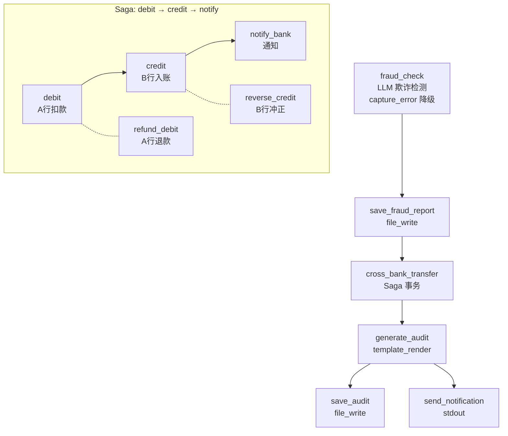

# Cross-Bank Transfer Saga — Killer Demo

> 金融可靠性场景：跨行转账 Saga 事务 — debit → credit → notify + 失败自动补偿。

展示 aflare 在金融可靠性场景的核心能力：**Saga 事务补偿、LLM 欺诈检测、幂等性、限流重试、审计合规**。

---

## 它能做什么

一个完整的跨行转账流程，包含 AI 风控、事务补偿和合规审计：

| 阶段 | 能力 | 实现 |
|------|------|------|
| 🛡️ 欺诈检测 | LLM 风险分析 | 转账前 AI 分析异常金额/黑名单/交易模式 |
| 🔄 Saga 事务 | 多步写入 + 补偿 | debit → credit → notify，失败自动反向补偿 |
| 🔑 幂等性 | 防重复扣款 | Idempotency-Key 服务端去重 |
| 🚦 限流重试 | 保护下游 | 令牌桶限流 + 指数退避重试 |
| 🛑 降级兜底 | LLM 不可用不阻塞 | capture_error 降级为人工审核 |
| 📜 审计合规 | 全链路记录 | 所有步骤自动生成审计轨迹 |

### Saga 执行语义

```
forward（顺序执行）          失败时 compensate（反向执行）
┌─────────┐  ┌─────────┐  ┌─────────┐
│  debit  │→ │ credit  │→ │ notify  │
│ A行扣款 │  │ B行入账 │  │ 通知    │
└─────────┘  └─────────┘  └─────────┘
                  │ 失败
                  ▼
         ┌───────────────┐
         │ refund-debit  │  ← 补偿 debit（反向第一步）
         │ A行退款       │
         └───────────────┘
```

- **forward 全部成功**：saga 提交，输出最后一步结果
- **某 forward 失败**：已完成的 forward 步骤按**反向顺序**执行 compensate
- **compensate 失败**：best-effort，记录告警并继续补偿其他步骤
- **第一步就失败**：无已完成步骤，不执行任何补偿

---

## 运行截图

### Mock 服务启动

```console
$ cd examples/killer-demos/06-cross-bank-saga
$ python3 mock-server.py

============================================================
  🏦  Mock Bank API — Cross-Bank Transfer Saga Demo
============================================================
  Listening on http://0.0.0.0:17904
  Credit fail amount: 9999.0
  Flaky probability:  0.15

  Endpoints:
    POST /debit     — A 行扣款
    POST /credit    — B 行入账（amount=9999 触发失败）
    POST /refund    — A 行退款（debit 补偿）
    POST /reverse   — B 行冲正（credit 补偿）
    POST /notify    — 转账通知
    GET  /health    — 健康检查
    GET  /ops       — 操作日志
    GET  /balances  — 账户余额

  Demo scenarios:
    amount=9999  → credit 失败 → debit 被补偿（退款）
    amount=5000  → 全部成功 → saga 提交
============================================================
```

### 正常转账路径（amount=5000）

```console
# 扣款
$ curl -s -X POST http://localhost:17904/debit \
  -H 'Content-Type: application/json' \
  -H 'Idempotency-Key: txn-001-debit' \
  -d '{"account":"ACC-001","amount":5000,"currency":"CNY","ref":"txn-001"}'
{"status":"success","endpoint":"debit","account":"ACC-001","amount":5000.0}

# 入账
$ curl -s -X POST http://localhost:17904/credit \
  -H 'Content-Type: application/json' \
  -H 'Idempotency-Key: txn-001-credit' \
  -d '{"account":"ACC-002","amount":5000,"currency":"CNY","ref":"txn-001"}'
{"status":"success","endpoint":"credit","account":"ACC-002","amount":5000.0}
```

### 补偿路径（amount=9999 触发 credit 失败）

```console
# credit 失败
$ curl -s -X POST http://localhost:17904/credit \
  -H 'Content-Type: application/json' \
  -d '{"account":"ACC-002","amount":9999}'
{"status":"failed","endpoint":"credit","error":"credit limit exceeded for demo amount"}

# 查看操作日志验证 saga 顺序
$ curl -s http://localhost:17904/ops | python3 -m json.tool
{
  "ops": [
    {"endpoint": "debit",  "status": "success"},   ← forward 1 ✓
    {"endpoint": "credit", "status": "failed"},    ← forward 2 ✗
    {"endpoint": "refund", "status": "success"}    ← compensate 1 ✓
  ]
}
```

### 工作流运行（补偿路径）

```console
$ aflare run workflow.yaml

[fraud_check] LLM analysis: risk_score=15, risk_level=low, decision=allow
[save_fraud_report] Written to fraud-report.json

[cross_bank_transfer] Saga started (3 steps)
[debit]  POST /debit  → 200 OK (ACC-001 -5000)
[credit] POST /credit → 500 FAILED (credit limit exceeded)
[cross_bank_transfer] Step 'credit' failed, starting compensation...
[refund_debit] POST /refund → 200 OK (ACC-001 +5000)
[cross_bank_transfer] Saga completed with compensation

[generate_audit] Audit trail generated
[save_audit] Appended to audit-trail.jsonl
[send_notification]
============================================
🏦  跨行转账 Saga 工作流执行完毕
============================================
转账编号: TXN-20260809-001
付款账户: ACC-001
收款账户: ACC-002
金额:     9999.00 CNY
转账结果: {"status":"compensated","error":"credit limit exceeded"}
============================================
```

### 工作流运行（成功路径）

```console
$ aflare run workflow.yaml --var amount=5000

[fraud_check] LLM analysis: risk_score=12, risk_level=low, decision=allow
[cross_bank_transfer] Saga started (3 steps)
[debit]  POST /debit  → 200 OK
[credit] POST /credit → 200 OK
[notify_bank] POST /notify → 200 OK
[cross_bank_transfer] Saga committed successfully

[send_notification]
============================================
🏦  跨行转账 Saga 工作流执行完毕
============================================
转账编号: TXN-20260809-001
转账结果: {"status":"committed"}
============================================
```

---

## 快速开始

### 1. 安装 aflare

```bash
curl -sL https://raw.githubusercontent.com/alib8b8/aflare/main/install.sh | bash
```

### 2. 启动 Mock 银行服务

```bash
cd examples/killer-demos/06-cross-bank-saga
python3 mock-server.py
# 输出: [mock-bank] Listening on http://0.0.0.0:17904
```

Mock 银行 API 端点：
- `POST /debit` — A 行扣款（始终成功）
- `POST /credit` — B 行入账（amount=9999 强制失败）
- `POST /refund` — A 行退款（debit 的补偿）
- `POST /reverse` — B 行冲正（credit 的补偿）
- `POST /notify` — 转账通知
- `GET /ops` — 查看操作日志
- `GET /balances` — 查看账户余额

### 3. 配置 LLM（用于欺诈检测）

```bash
export OPENAI_API_KEY="sk-..."
```

### 4. 运行工作流

```bash
# 演示补偿路径（amount=9999，credit 失败 → debit 被补偿）
aflare run workflow.yaml

# 演示成功路径（amount=5000，全部成功）
aflare run workflow.yaml --var amount=5000
```

### 5. 验证 Saga 执行顺序

```bash
# 查看 mock 服务的操作日志
curl http://localhost:17904/ops | python3 -m json.tool

# 查看账户余额
curl http://localhost:17904/balances | python3 -m json.tool
```

补偿路径下的操作顺序：
```json
{"ops": [
  {"endpoint": "debit",  "status": "success"},  // forward 1 ✓
  {"endpoint": "credit", "status": "failed"},   // forward 2 ✗
  {"endpoint": "refund", "status": "success"}   // compensate 1 ✓
]}
```

### 6. 查看审计轨迹

```bash
cat audit-trail.jsonl
cat fraud-report.json
```

---

## 工作流架构



### 核心设计要点

| 特性 | 实现方式 |
|------|----------|
| **Saga 事务补偿** | `saga` 步骤：forward 顺序执行，失败反向 compensate |
| **LLM 欺诈检测** | `openai` 节点分析风险，输出结构化 JSON |
| **降级兜底** | `capture_error` 分支：LLM 不可用时降级为人工审核 |
| **幂等性** | `Idempotency-Key` 请求头，mock 服务端去重 |
| **限流重试** | `rate_limit_rps` + `max_retries` + `retry_backoff_ms` |
| **审计合规** | `template_render` 生成审计轨迹 + `file_write` 落盘 |
| **故障注入** | mock 服务约 15% 概率返回 503，验证重试逻辑 |

---

## 不同场景演示

修改 `workflow.yaml` 中的 `amount` 变量或通过命令行覆盖：

| amount | 行为 | 命令 |
|--------|------|------|
| `9999` | credit 失败 → debit 补偿 | `aflare run workflow.yaml` |
| `5000` | 全部成功，saga 提交 | `aflare run workflow.yaml --var amount=5000` |
| 其他值 | 全部成功 | `aflare run workflow.yaml --var amount=1000` |

### 自定义故障注入

```bash
# 修改触发失败的金额
MOCK_CREDIT_FAIL_AMOUNT=5000 python3 mock-server.py

# 调整瞬时故障概率
MOCK_FLAKY_PROBABILITY=0.3 python3 mock-server.py
```

---

## 生产须知

1. **补偿必须幂等**：compensate 步骤可能被多次执行，必须通过 `Idempotency-Key` 保证幂等
2. **补偿失败需人工介入**：best-effort 意味着补偿失败不会无限重试，应有告警和待办流程
3. **审计是合规依据**：所有 forward/compensate 步骤自动记录，是金融合规的核心证据
4. **配合服务端幂等**：真实跨行转账仍需银行 API 支持服务端幂等和冲正接口
5. **不替代分布式事务**：saga 是最终一致性模型，强一致场景仍需 2PC

---

## 文件结构

```
06-cross-bank-saga/
├── workflow.yaml        # 工作流定义（核心）
├── mock-server.py       # Mock 银行 API
├── README.md            # 本文档
├── audit-trail.jsonl    # 审计轨迹（运行后自动创建）
└── fraud-report.json    # 欺诈检测报告（运行后自动创建）
```

---

## 相关资源

- [aflare 文档](https://github.com/alib8b8/aflare)
- [Saga 事务补偿指南](https://github.com/alib8b8/aflare/blob/main/docs/saga.md)
- [04-github-daily-digest](../04-github-daily-digest/) — 个人自动化场景
- [05-code-review-pipeline](../05-code-review-pipeline/) — 代码审查流水线