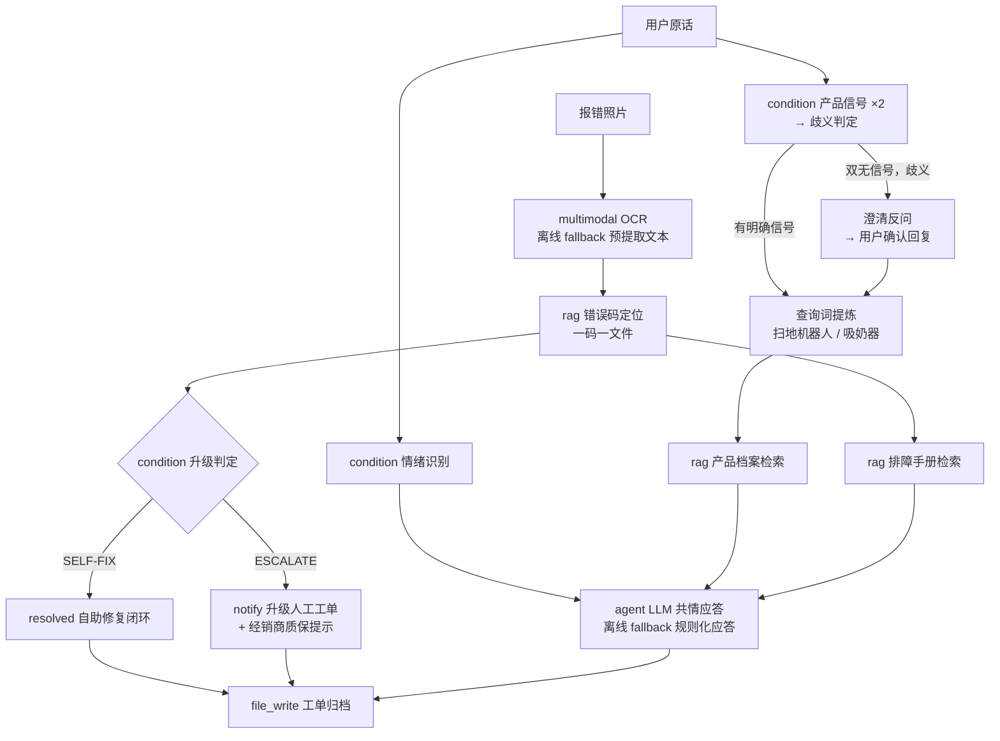

# AI 售后智能客服（After-Sales Support）

> 一次零散求助 → 完整服务闭环：情绪识别 → 产品消歧 → 看图识错（OCR）→ 知识库排障（RAG）→ 升级判定 → 工单归档。规则决定"该安抚、该反问、该升级"，检索负责"答得有据"，LLM 负责"说得像人"——三层全部带离线降级，链路永不因组件不可用而中断。

## 使用场景

王女士发来一句暴躁的求助——"我的 S1 Pro 不吸了！明天要开派对，急死了！！"，随手附了一张报错照片。这句话里藏着四个问题，每个都不是"直接回答"能解决的：

1. **她在焦虑**——明天派对，机器罢工。第一句必须先接住情绪，而不是甩手册链接。
2. **"S1 Pro"是歧义的**——产品线里既有 S1 Pro 智能吸奶器，也有 S1 Pro 扫地机器人，都"吸"。答非所问是最快的流失。
3. **照片里是 E-13**——主刷过载，自助可修；但若是 E-99 电机烧毁，必须升级人工返厂。升级判定是规则，不能让模型即兴。
4. **回复要有据**——共情话术 + 排障步骤全部来自知识库检索，不编造知识库之外的内容。

工作流用四层分工解决：

| 层 | 节点 | 职责 | 离线降级 |
|----|------|------|----------|
| 规则层 | `condition` | 情绪信号 / 产品信号 / 歧义判定 / 升级判定，全部显式正则——该安抚、该反问、该升级由流程决定，不是模型即兴 | 纯本地，无需降级 |
| 检索层 | `rag` | 产品档案 / 错误码 / 排障手册三库检索；规则层先把用户话术提炼成干净查询词（中文分词短板由编排补齐） | 纯本地，无需降级 |
| 多模态 | `multimodal` | 报错照片 OCR 读取错误码 | 无 tesseract / 视觉模型时降级到预提取文本 |
| LLM 应答 | `agent` | 共情话术 + 口语化分步排障引导 | fallback 规则化应答，检索结果不丢失 |

知识库设计要点：

- **一码一文件**（[kb/error-codes/](kb/error-codes/)）：检回的 chunk 只含当前错误码的升级判定，不会把其他错误码的 ESCALATE 标记混进来污染升级判定。
- **查询词提炼**：下游检索的输入是提炼词（产品词 + 照片识读），不是上游检索的组装上下文——上下文里的样板词（"Retrieved N chunks"）会污染下一次检索。
- **报错照片可再生成**：[genscreen.go](genscreen.go)（`go run`，纯标准库点阵绘制）生成设备屏幕风格的 E-13 / E-99 报错图。

## 节点流程图



## 输入

| 参数 | 说明 | 默认值 | 必填 |
|------|------|--------|------|
| `user_name` / `user_message` | 用户与求助原话 | 王女士 / "我的 S1 Pro 不吸了！……" | 否 |
| `user_clarified` | 消歧反问后的确认回复（交互式部署替换为 human_in_loop / WebUI 对话） | "扫地机器人，派对前要把家里打扫干净" | 否 |
| `error_photo` | 报错照片路径 | `fixtures/error-e13.png` | 否 |
| `photo_text_fallback` | OCR 离线降级文本 | `E-13 BRUSH OVERLOAD` | 否 |
| `kb_products` / `kb_errors` / `kb_manuals` / `kb_dealers` | 产品 / 错误码 / 手册 / 经销商知识库路径 | `kb/` 下各目录 | 否 |
| `provider` / `model` | LLM 供应商与模型 | `ollama` / `llama3` | 否 |
| `ticket_path` | 工单输出路径 | `after-sales-ticket.md` | 否 |

## 运行命令

```bash
# 1. 默认场景：E-13 主刷过载 → 自助修复闭环（零外部依赖，OCR / LLM 自动降级）
aflare run examples/real-world/after-sales-support/workflow.yaml

# 2. 升级场景：E-99 主电机烧毁 → 升级人工 + 经销商质保提示
aflare run examples/real-world/after-sales-support/workflow.yaml \
  --set error_photo=examples/real-world/after-sales-support/fixtures/error-e99.png \
  --set 'photo_text_fallback=E-99 MOTOR BURNOUT' \
  --set ticket_path=after-sales-ticket-e99.md

# 3. 语法验证（零依赖）
aflare validate examples/real-world/after-sales-support/workflow.yaml
```

中途 Ctrl-C 后 `aflare run --resume` 可从已完成步骤续跑（断点续跑）。

## 两个场景的预期结果

| 环节 | E-13（默认） | E-99（`--set` 切换） |
|------|--------------|----------------------|
| 情绪识别 | true（"急死了！！"命中焦虑信号） | true |
| 消歧反问 | true（"S1 Pro 不吸了"双产品信号皆无） | true |
| 设备档案 | 检回扫地机器人档案 | 检回扫地机器人档案 |
| 错误码 | E-13 主刷过载，SELF-FIX | E-99 电机烧毁，ESCALATE |
| 处理结果 | resolved 自助修复闭环 | escalated 升级人工（notify 携带经销商质保提示） |

每次运行产出审计工单（默认 `after-sales-ticket.md`）：全流程判定、每步检索依据与应答全文。
