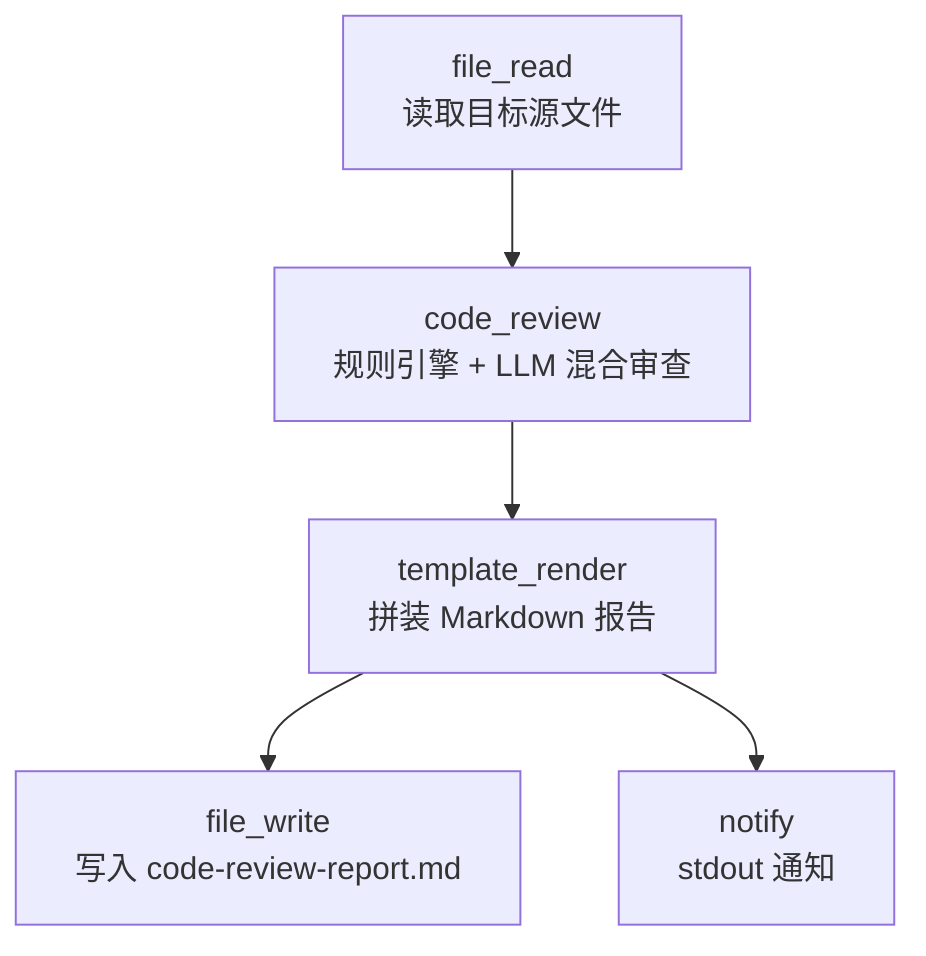

# Code Review Pipeline

> 真实可运行的代码审查流水线：确定性规则引擎 + LLM 深度分析的混合审查，输出 Markdown 报告。

## 使用场景

在提交代码或合并 PR 之前，对单个源文件做一次"双保险"审查：

1. **确定性规则引擎**：快速扫描 NPE（空指针）、线程安全、硬编码密钥等模式——不依赖 LLM，结果稳定可复现。
2. **LLM 深度分析**：调用本地 Ollama（默认 `llama3`）或云端模型，从语义层面识别逻辑缺陷、性能隐患、可维护性问题。

两条链路在 `code_review` 节点内部融合，最终由 `template_render` 拼装成一份带源码预览和审查结论的 Markdown 报告。

## 节点流程图



## 输入

| 参数 | 说明 | 默认值 | 必填 |
|------|------|--------|------|
| `target_file` | 待审查的源文件路径（相对工作目录） | `internal/nodes/transform.go` | 否 |
| `focus` | 审查重点：`all` / `bugs` / `security` / `style` / `performance` | `all` | 否 |
| `severity` | 最低报告严重级别：`low` / `medium` / `high` / `critical` | `medium` | 否 |
| `provider` | LLM 供应商：`ollama` / `openai` / `deepseek` / `glm` / `qwen` ... | `ollama` | 否 |
| `model` | 模型名 | `llama3` | 否 |
| `report_path` | 报告输出路径 | `code-review-report.md` | 否 |

## 运行命令

```bash
# 1. 默认配置（审查本仓库的 transform.go，使用本地 ollama）
llm-box run examples/real-world/code-review-pipeline/workflow.yaml

# 2. 审查指定文件，聚焦安全问题
llm-box run examples/real-world/code-review-pipeline/workflow.yaml \
  --var target_file=path/to/your/file.go \
  --var focus=security \
  --var severity=high

# 3. 使用云端模型（需设置对应环境变量，如 OPENAI_API_KEY）
llm-box run examples/real-world/code-review-pipeline/workflow.yaml \
  --var provider=openai --var model=gpt-4o
```

> **本地 dry-run**：若本地未启动 Ollama，`code_review` 节点的 LLM 子步骤会失败，但确定性规则引擎仍会运行——`workflow.yaml` 语法本身始终合法，可用 `llm-box run --dry-run`（如可用）校验结构。

## 输出示例

控制台输出：

```
Code review complete. Report written to code-review-report.md.
```

`code-review-report.md` 片段：

```markdown
# Code Review Report

**Target file:** `internal/nodes/transform.go`
**Focus:** all · **Min severity:** medium
**Provider:** ollama/llama3

---

## Source Preview (first 15 lines)

```
// Copyright (c) 2026 llm-box Contributors
...
```

## Hybrid Review Findings

The review below combines deterministic rule-engine output
(NPE, thread-safety, security) with LLM deep analysis.

[Severity: medium] transform.go:60 — large switch statement without
default case; unexpected operations silently pass through...
```

## 设计要点

- **混合审查**：`code_review` 节点的 `use_rules: "true"` + `use_llm: "true"` 同时启用两条链路，体现项目"确定性规则 + LLM"特色。
- **正确的表达式语法**：使用 `{{var.target_file}}`、`{{step.read_source}}`、`{{step.review}}`——这是 llm-box workflow 引擎真正解析的语法（注意：不是 Go 模板的 `{{ .foo }}`）。
- **线性数据流**：每步的输出自动成为下一步的输入；`template_render` 通过 `{{step.X}}` 跨步引用，避免数据丢失。
- **可配置**：所有可变参数集中在 `vars:` 块，支持命令行 `--var` 覆盖。
