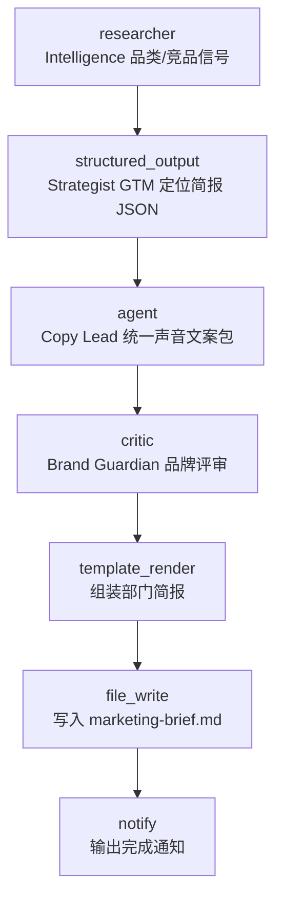

# Digital Company — Marketing Department

> 数字公司市场部蓝本（对照 [OpenExecutive](https://github.com/SenteLabsAI/OpenExecutive) 的 8 角色高管拆解）：**Market Intelligence Analyst** 扫描开放数据源采集品类/竞品信号 → **GTM Strategist** 产出结构化定位简报 → **Campaign Copy Lead** 以统一品牌声音产出对外文案 → **Brand Guardian** 独立评审后归档部门周报。

## 使用场景

OpenExecutive 用 8 个专职 specialist（CSO / CMO / CFO…）支撑"一个一致的对外高管声音"，内部角色架构永不暴露。本蓝本把该模式映射到市场部：4 个角色逐级交接、每步交接物结构化、对外输出只有一份统一声音的文案。

1. **情报采集**：`researcher` 抓取开放、免密钥的数据源（Hacker News Algolia API）做品类/竞品调研——对应 OpenExecutive CSO 的 competitive analysis 职责。
2. **策略结构化**：`structured_output` 把情报钉进 GTM 定位简报 JSON Schema（market_signals / target_segment / positioning / key_message / channels / competitor_gaps / risks）——对应 CMO 的 GTM strategy 职责，交接物是规整契约而非自由文本。
3. **统一声音产出**：`agent` 以文案指导系统提示词运行，`input:` 列表合并情报 + 策略两路输入，产出 HEADLINE / ONE-LINER / LAUNCH POST / EMAIL SUBJECT / CTA 一页文案包——对外材料只有一个声音，且提示词明确禁止内部角色泄漏。
4. **独立品牌评审**：`critic` 以品牌一致性 / 单一声音 / 事实性 / 渠道匹配 / 合规 / 无内部角色泄漏六项标准评审文案——评审者与产出者分离。

典型用途：GTM 流程原型、内容生产流水线、多智能体角色蓝本的参考实现（可直接改造为其他部门）。

## 节点流程图



## 输入

| 参数 | 说明 | 默认值 | 必填 |
|------|------|--------|------|
| `category` | 目标品类 | `workflow automation` | 否 |
| `research_urls` | 情报数据源（逗号分隔，开放免密钥） | HN Algolia 两个查询 | 否 |
| `provider` | LLM 供应商 | `ollama` | 否 |
| `model` | 模型名 | `llama3` | 否 |
| `brief_path` | 简报输出路径 | `marketing-brief.md` | 否 |

## 运行命令

```bash
# 1. 本地跑通（需 Ollama + llama3）
aflare run examples/real-world/digital-company-marketing/workflow.yaml

# 2. 换品类与数据源（URL 里的空格需编码为 %20）
aflare run examples/real-world/digital-company-marketing/workflow.yaml \
  --set category="customer data platform" \
  --set research_urls="https://hn.algolia.com/api/v1/search?query=customer%20data%20platform&tags=story&hitsPerPage=15"

# 3. 用云端模型（配好对应 API key 环境变量）
aflare run examples/real-world/digital-company-marketing/workflow.yaml \
  --set provider=deepseek --set model=deepseek-chat
```

## 输出示意

`marketing-brief.md`：

```markdown
# Marketing Brief — workflow automation

## 2. Positioning Brief (Strategist)
{"target_segment":"individual developers automating their own toolchain",
 "positioning":"The workflow engine that runs entirely on your machine",
 "key_message":"AI beyond chat — get things done", ...}

## 3. Campaign Material (Copy Lead)
HEADLINE: Your workflows belong to you
ONE-LINER: A local-first AI workflow engine — no cloud, no vendor lock-in.
LAUNCH POST: ...

## 4. Brand Review (Guardian)
Single voice maintained across all material; claims are supportable;
channel fit confirmed for developer communities.
```

## 设计要点（对照 OpenExecutive）

- **角色拆解映射**：OpenExecutive 的 CSO（竞争分析）落到 Intelligence Analyst，CMO（GTM / 品牌 / 传播）拆成 Strategist（策略）+ Copy Lead（传播），"single coherent voice" 纪律落到 Copy Lead 的提示词约束 + Brand Guardian 的评审标准。
- **交接物契约化**：策略环节用 `structured_output`（JSON Schema）而非自由文本——OpenExecutive 各 specialist 的职责/交接物分解在 aflare 里就是"一步一节点一 Schema"。
- **单一声音**：对外材料只从 Copy Lead 一处产出，提示词显式禁止提及内部角色/生产过程（"internal agent architecture is never exposed"）；Guardian 评审标准含 `no_internal_role_leakage`。
- **提案与评审分离**：品牌评审是 `critic` 对文案的独立评审，不是 Copy Lead 自评。
- **零商业依赖**：默认数据源开放免密钥（HN Algolia），默认模型本地可跑（Ollama），克隆即用。

> **声明**：本示例演示多智能体编排模式，产出的营销材料请人工审核后再对外使用。
