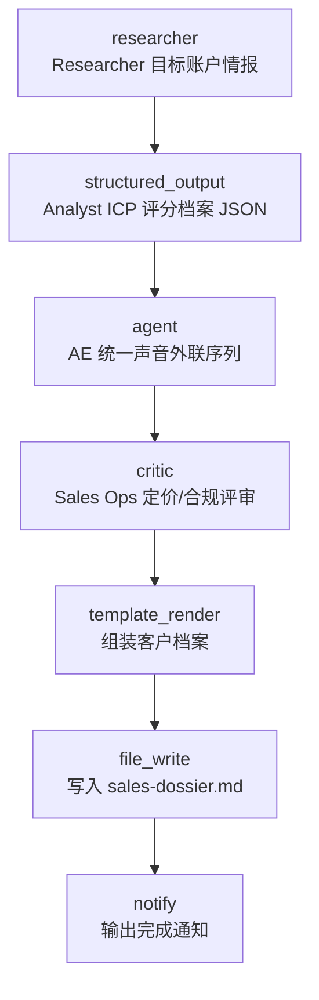

# Digital Company — Sales Department

> 数字公司销售部蓝本（对照 [OpenExecutive](https://github.com/SenteLabsAI/OpenExecutive) 的 8 角色高管拆解）：**Account Researcher** 采集目标账户开源情报 → **Sales Analyst** 产出结构化 ICP 评分档案 → **Account Executive** 以统一声音起草外联序列 → **Sales Ops Review** 独立评审定价纪律与承诺合规后归档客户档案。

## 使用场景

OpenExecutive 的三个核心纪律——角色职责分解、交接物契约化、对外单一声音——在本蓝本落到销售动作上：调研 → 评分 → 外联 → 评审，每步一个专职节点。

1. **账户情报**：`researcher` 抓取开放、免密钥的数据源（Hacker News Algolia API，故事 + 评论双查询）做目标账户调研——产品足迹、用户情绪、反复出现的抱怨（抱怨即痛点）。
2. **评分契约**：`structured_output` 把情报钉进 ICP 评分档案 JSON Schema（signals / icp_fit_score / pain_points / trigger_events / recommended_angle / risks）——交接物规整，AE 不需要读原始噪音。
3. **统一声音外联**：`agent` 以客户经理系统提示词运行，`input:` 列表合并情报 + 评分两路输入，产出 VALUE PROPOSITION / FIRST EMAIL / FOLLOW-UP CADENCE / OBJECTION PREP / CTA 一页外联序列——只能引用档案支持的主张，禁止内部角色泄漏。
4. **独立运营评审**：`critic` 以定价纪律 / 承诺合规 / 事实准确 / 单一声音 / 反垃圾敏感度 / 无内部角色泄漏六项标准评审——评审者与产出者分离，草稿发出前必须过这道门。

典型用途：销售调研流程原型、outreach 草稿生成、多智能体角色蓝本的参考实现（与 marketing 部同构，可直接改造为其他部门）。

## 节点流程图



## 输入

| 参数 | 说明 | 默认值 | 必填 |
|------|------|--------|------|
| `target_company` | 目标公司名（演示值，换成你的真实目标） | `Supabase` | 否 |
| `offering` | 你在卖的东西（一句话） | `a local-first AI workflow engine for developers` | 否 |
| `research_urls` | 情报数据源（逗号分隔，开放免密钥） | HN Algolia 双查询 | 否 |
| `provider` | LLM 供应商 | `ollama` | 否 |
| `model` | 模型名 | `llama3` | 否 |
| `dossier_path` | 档案输出路径 | `sales-dossier.md` | 否 |

## 运行命令

```bash
# 1. 本地跑通（需 Ollama + llama3）
aflare run examples/real-world/digital-company-sales/workflow.yaml

# 2. 换目标公司与卖点（URL 里的空格需编码为 %20）
aflare run examples/real-world/digital-company-sales/workflow.yaml \
  --set target_company="Vercel" \
  --set offering="an on-call automation agent for platform teams" \
  --set research_urls="https://hn.algolia.com/api/v1/search?query=Vercel&tags=story&hitsPerPage=15,https://hn.algolia.com/api/v1/search_by_date?query=Vercel&tags=comment&hitsPerPage=15"

# 3. 用云端模型（配好对应 API key 环境变量）
aflare run examples/real-world/digital-company-sales/workflow.yaml \
  --set provider=deepseek --set model=deepseek-chat
```

## 输出示意

`sales-dossier.md`：

```markdown
# Sales Dossier — Supabase

## 2. Lead Scoring (Analyst)
{"icp_fit_score":72,
 "pain_points":["workflow glue code maintenance","CI pipeline toil"],
 "trigger_events":["launched edge functions runtime"],
 "recommended_angle":"replace hand-rolled ops glue with declarative workflows", ...}

## 3. Outreach Sequence (Account Executive)
VALUE PROPOSITION: Declarative workflows that remove the ops glue code
your team maintains around the database.
FIRST EMAIL: Subject: the glue code tax ...

## 4. Sales Ops Review
Pricing discipline maintained; claims map to dossier signals; single
voice confirmed across email and follow-ups.
```

## 设计要点（对照 OpenExecutive）

- **角色拆解映射**：OpenExecutive 的 CSO（竞争分析）落到 Account Researcher，交接物纪律落到 Sales Analyst 的 JSON 档案，"single coherent voice" 落到 AE 的提示词约束 + Sales Ops 的评审标准。
- **情报即痛点**：researcher 默认查 HN 评论流（`tags=comment`）——公开抱怨是 B2B 痛点最密集的免费信号源，无需任何商业数据订阅。
- **承诺纪律**：AE 提示词限定"只能引用档案支持的主张"，Sales Ops 评审标准含 `promise_compliance` 与 `factual_accuracy`——多智能体互查防幻觉话术。
- **单一声音**：外联材料只从 AE 一处产出，禁止提及内部角色/生产过程；`spam_sensitivity` 标准约束外联节奏。
- **零商业依赖**：默认数据源开放免密钥（HN Algolia），默认模型本地可跑（Ollama），克隆即用。

> **声明**：本示例演示多智能体编排模式。默认目标公司仅为演示数据——产出的外联草稿是内部草稿，经人工审核前不得发送。
