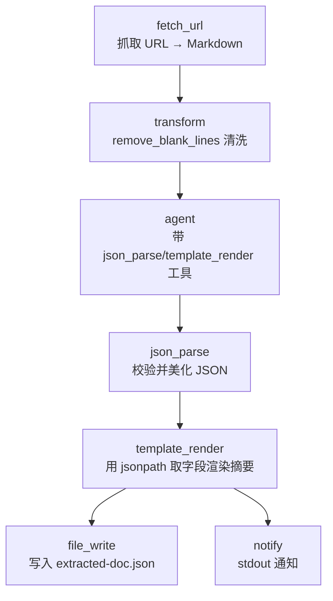

# Document Extractor

> 抓取网页/本地文档，由带工具的 Agent 抽取结构化字段，校验 JSON 合法性，并渲染可读摘要。

## 使用场景

需要从一份非结构化文档（README、产品页、技术博客、API 文档）中提取**结构化信息**时使用：

- 给定一个 URL，自动抓取并清洗文本
- Agent 自主调用 `json_parse` / `template_render` 工具，按 schema 提取字段
- `json_parse` 节点校验输出确实是合法 JSON（而非夹杂散文的伪 JSON）
- `template_render` 用 `jsonpath` 语法从 JSON 中取个别字段，拼装成人读摘要

典型用途：竞品功能盘点、文档入库前的元数据抽取、README 自动归档。

## 节点流程图



## 输入

| 参数 | 说明 | 默认值 | 必填 |
|------|------|--------|------|
| `source_url` | 待抓取的文档 URL（http/https/raw） | aflare 仓库 README | 否 |
| `extraction_schema` | 期望抽取的 JSON 结构（提示 Agent 用） | `{"title","summary","key_features","install_cmd"}` | 否 |
| `provider` | LLM 供应商 | `ollama` | 否 |
| `model` | 模型名 | `llama3` | 否 |
| `output_path` | 抽取结果输出路径 | `extracted-doc.json` | 否 |

## 运行命令

```bash
# 1. 默认：抓取 aflare README 并提取标题/摘要/安装命令
aflare run examples/real-world/doc-extractor/workflow.yaml

# 2. 抓取任意 URL
aflare run examples/real-world/doc-extractor/workflow.yaml \
  --var source_url=https://example.com/product-docs

# 3. 用云端模型（更强抽取能力）
aflare run examples/real-world/doc-extractor/workflow.yaml \
  --var provider=deepseek --var model=deepseek-chat
```

> **本地 dry-run**：未启动 Ollama 时，`agent` 节点会失败；但 `fetch_url` → `transform` 链路可独立验证抓取与清洗是否正常。整份 `workflow.yaml` 语法始终合法。

## 输出示例

控制台：

```
Document extracted. JSON saved to extracted-doc.json.
```

`extracted-doc.json`（经 `json_parse` 校验后的合法 JSON）：

```json
{
  "title": "aflare",
  "summary": "A workflow engine and multi-model agent runtime for building AI-powered automation pipelines.",
  "key_features": [
    "100+ workflow nodes",
    "Multi-provider LLM routing",
    "YAML-based workflow definition",
    "MCP protocol support"
  ],
  "install_cmd": "curl -fsSL https://raw.githubusercontent.com/alib8b8/aflare/main/install.sh | bash"
}
```

`template_render` 渲染的摘要片段：

```markdown
# Document Extraction Summary

**Source:** https://raw.githubusercontent.com/.../README.md

## Extracted JSON
```json
{ ... }
```

## Field Highlights
- **Title:** aflare
- **Summary:** A workflow engine and multi-model agent runtime...
- **Install command:** `curl -fsSL ... | bash`
```

## 设计要点

- **Agent + 工具调用**：`agent` 节点通过 `tools: json_parse,template_render` 启用工具调用，体现项目 ReAct Agent 能力，而非纯文本生成。
- **JSON 校验闭环**：Agent 输出后立即用 `json_parse` 节点校验——若 Agent 返回的不是合法 JSON，此处会报错，避免下游污染。
- **jsonpath 跨步引用**：`{{step.validate.jsonpath:$.title}}` 演示从结构化数据中取字段，比让 LLM 再生成一遍更可靠。
- **线性清洗链**：`fetch_url` → `transform(remove_blank_lines)` → `agent`，每步输出自然流入下一步。
