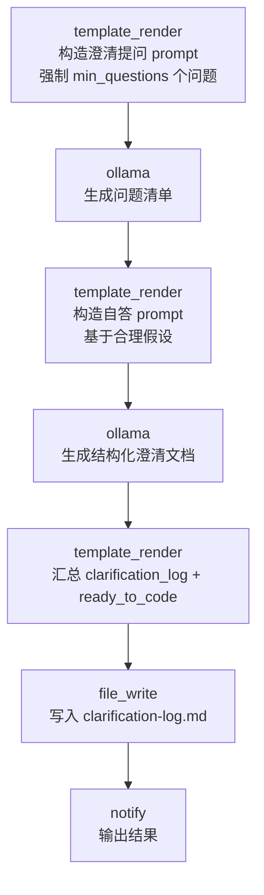

# Grill-Me 约束技能

> 约束型技能：强制 AI 在写任何代码之前，先针对需求提出至少 `min_questions` 个澄清问题并自答，输出结构化的需求澄清文档。借鉴自 [mattpocock/skills](https://github.com/mattpocock/skills) 的 `/grill-me` 设计理念。

## 设计理念

`mattpocock/skills` 的 `/grill-me` 用一条硬约束来纠正 AI"急于动手写代码"的倾向：**写代码前必须先问够 50+ 个澄清问题**。本技能把这个理念落地成可运行的工作流——AI 被强制进入"只问不写"的澄清阶段，覆盖边界条件、错误处理、性能、安全、兼容性、测试、部署等维度，随后基于合理假设自答这些问题，最后才判定 `ready_to_code`。

这是一种**agent-discipline（智能体自律）**型约束：与其让模型凭直觉补全模糊需求，不如显式地把假设摆到台面上。

## 使用场景

- 接到一个一句话需求，想在动手前把隐含假设挖出来。
- 团队 code review 前先产出一份"需求澄清文档"作为评审依据。
- 给 LLM agent 加一道闸门：未澄清不写码，避免基于错误假设的大段实现。
- 教学 / 演示"约束型技能"如何用 workflow 强制 AI 行为。

## 工作流程



**关键约束**：在提问阶段（步骤 1-2）和自答阶段（步骤 3-4），prompt 明确禁止输出任何代码——只允许提问和澄清。

## 覆盖的澄清维度

prompt 至少覆盖以下 10 个维度，每个维度多个问题：

| 维度 | 关注点 |
|------|--------|
| 边界条件 | 空值、极值、溢出、off-by-one |
| 错误处理 | 失败模式、重试、幂等、错误传播 |
| 性能要求 | 延迟、吞吐、并发、内存、缓存 |
| 安全考量 | 认证授权、输入校验、密钥、审计 |
| 兼容性 | 前后向兼容、平台、依赖版本 |
| 测试策略 | 单元/集成/e2e、覆盖率、fixture |
| 部署环境 | 运行时、配置、网络、回滚 |
| 数据与状态 | schema、迁移、一致性、缓存失效 |
| API 契约 | 版本、分页、错误码、限流 |
| 可观测性 | 指标、日志、链路追踪、告警、SLO |

## 输入

| 参数 | 说明 | 默认值 | 必填 |
|------|------|--------|------|
| `task_description` | 要实现的需求描述 | （空） | 是 |
| `min_questions` | 最少提问数（约束阈值） | `50` | 否 |
| `provider` | LLM 供应商 | `ollama` | 否 |
| `model` | 模型名 | `llama3` | 否 |

## 输出

| 输出 | 说明 |
|------|------|
| `clarification_log` | 澄清问答记录（问题 + 假设性自答 + 置信度） |
| `ready_to_code` | 是否满足开始编码条件（澄清完成后为 `true`） |

## 运行命令

```bash
# 1. 基础用法：对一个需求做 50+ 问题的澄清
llm-box run examples/real-world/grill-me/workflow.yaml \
  --var task_description="实现一个支持断点续传的大文件上传服务"

# 2. 调高提问阈值，做更彻底的澄清
llm-box run examples/real-world/grill-me/workflow.yaml \
  --var task_description="为现有 REST API 增加 OAuth2 鉴权层" \
  --var min_questions=80

# 3. 换用本地其它模型
llm-box run examples/real-world/grill-me/workflow.yaml \
  --var task_description="设计一个分布式任务调度器" \
  --var model=qwen2.5
```

> **本地 dry-run**：本技能的 LLM 步骤依赖 Ollama。`workflow.yaml` 语法始终合法，无需 Ollama 即可加载。

## 输出示例片段

控制台：

```
Grill-Me complete. ready_to_code=true. Clarification log written to clarification-log.md (target: 50+ questions).
```

`clarification-log.md`（节选）：

```markdown
# Requirements Clarification Log (Grill-Me)

**Task:** 实现一个支持断点续传的大文件上传服务
**Minimum questions threshold:** 50
**Provider / Model:** ollama / llama3

---

## 1. Clarification Questions

Q1. [边界条件] 单个文件的最大允许大小是多少？是否需要拒绝超过阈值的请求？
Q2. [边界条件] 空文件（0 字节）是否允许上传？如何处理？
Q3. [错误处理] 客户端在分片上传中断后重连，如何识别这是同一份文件？
Q4. [性能要求] 期望的并发上传数是多少？单连接的吞吐目标？
...
Q50. [可观测性] 是否需要为每个上传任务暴露进度查询接口？

## 2. Clarification Answers (Assumption-Based)

A1. [high] 单文件上限 5GB；超过则返回 413 并提示分卷。
A2. [medium] 允许空文件，直接落盘并返回成功。
A3. [high] 使用内容哈希（SHA-256）+ 文件名 + 大小作为唯一键，客户端重连时携带。
...
A42. [NEEDS HUMAN INPUT] 是否需要对接对象存储（S3/OSS）还是自建块存储？

## 3. Readiness Check

- **clarification_log:** produced above (questions + assumption-based answers).
- **ready_to_code:** true
- **rationale:** The clarification phase is complete. Questions were
  generated against the minimum threshold of 50 and answered with explicit
  assumptions. Before writing production code, review every item marked
  "[NEEDS HUMAN INPUT]" with stakeholders.
```

## 设计要点

- **约束即 prompt**：澄清阶段的 prompt 明确写"You MUST NOT write any code"，用模板把约束固化进工作流，而非依赖模型自觉。
- **自答显式化假设**：第二步让模型对每个问题给出"合理假设 + 置信度"，把原本藏在黑箱里的假设摆到台面，标记 `[NEEDS HUMAN INPUT]` 的项需要人工确认。
- **阈值可调**：`min_questions` 是一个变量阈值，简单需求调低、关键系统调高，体现约束强度可配置。
- **分层不变**：和其它 real-world 技能一致，确定性部分（`template_render` 组装 prompt、`file_write` 落盘、`notify` 通知）零成本可复现，只有 `ollama` 节点产生 LLM 开销。
