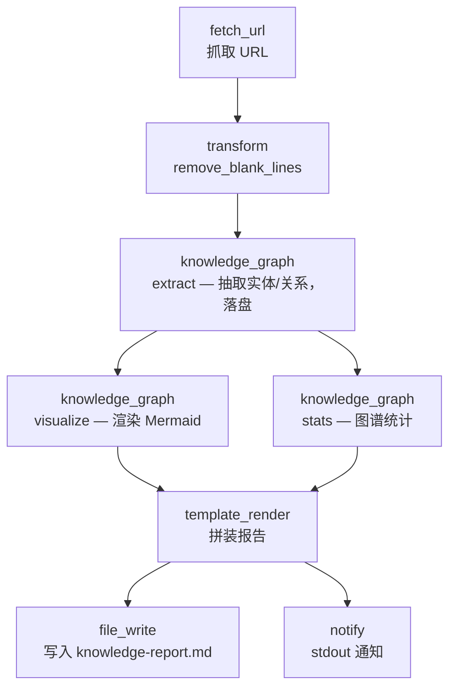
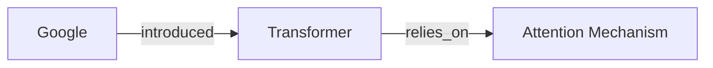

# Knowledge Curator

> 从网页文档中抽取实体与关系，构建持久化知识图谱，渲染 Mermaid 可视化，并生成 Markdown 整理报告。

## 使用场景

当你需要把零散的网页资料"结构化沉淀"为可查询的知识库时：

- 抓取一篇技术文章 / Wiki 页面 / 产品文档
- 用 `knowledge_graph` 节点抽取实体（人、组织、技术、概念）与关系
- 把图谱持久化到 `knowledge-graph.json`，**后续可重复运行不同 URL 来增量扩展同一份图谱**
- 生成 Mermaid 关系图 + 统计摘要 + 实体清单的整理报告

典型用途：调研笔记整理、竞品知识库构建、论文综述辅助。

## 节点流程图



## 输入

| 参数 | 说明 | 默认值 | 必填 |
|------|------|--------|------|
| `source_url` | 待整理的文档 URL | 维基百科 LLM 词条 | 否 |
| `graph_path` | 知识图谱 JSON 落盘路径（可复用扩展） | `knowledge-graph.json` | 否 |
| `report_path` | 整理报告输出路径 | `knowledge-report.md` | 否 |
| `max_depth` | 可视化时关系遍历最大深度 | `2` | 否 |
| `top_k` | 抽取实体/关系上限 | `15` | 否 |

## 运行命令

```bash
# 1. 默认：整理维基百科 LLM 词条
llm-box run examples/real-world/knowledge-curator/workflow.yaml

# 2. 整理任意 URL，写入自定义图谱文件
llm-box run examples/real-world/knowledge-curator/workflow.yaml \
  --var source_url=https://example.com/tech-article \
  --var graph_path=my-kb.json

# 3. 增量扩展：对同一 graph_path 重复运行不同 URL
llm-box run examples/real-world/knowledge-curator/workflow.yaml \
  --var source_url=https://example.com/article-2 \
  --var graph_path=my-kb.json
```

> **本地 dry-run**：`knowledge_graph` 节点的实体抽取依赖内置 LLM（默认 ollama）。未启动 Ollama 时该节点会失败；但 `fetch_url` → `transform` 链路可独立验证。`workflow.yaml` 语法始终合法。

## 输出示例

控制台：

```
Knowledge graph saved to knowledge-graph.json; report at knowledge-report.md.
```

`knowledge-graph.json`（持久化图谱，节选）：

```json
{
  "entities": [
    {"id": "e1", "name": "Transformer", "type": "Architecture"},
    {"id": "e2", "name": "Google", "type": "Organization"},
    {"id": "e3", "name": "Attention Mechanism", "type": "Concept"}
  ],
  "relations": [
    {"subject": "e2", "predicate": "introduced", "object": "e1"},
    {"subject": "e1", "predicate": "relies_on", "object": "e3"}
  ]
}
```

`knowledge-report.md` 节选：

```markdown
# Knowledge Curation Report

**Source:** https://en.wikipedia.org/wiki/Large_language_model
**Graph file:** `knowledge-graph.json`

## Graph Statistics
Entities: 15 · Relations: 22 · Density: 0.13

## Extracted Entities & Relations
- **Transformer** (Architecture) — introduced by **Google**
- **Transformer** relies_on **Attention Mechanism**
...

## Knowledge Graph (Mermaid)

```

## 设计要点

- **图谱持久化与复用**：`graph_path` 让 `extract` 写盘、`visualize`/`stats` 读盘——多次运行不同 URL 可增量扩展同一份知识库，体现"curator"语义。
- **同节点多动作编排**：连续三步都调用 `knowledge_graph`，分别用 `extract` / `visualize` / `stats` 动作，展示单节点的多面能力。
- **跨步引用汇总**：`template_render` 同时引用 `{{step.extract}}`、`{{step.visualize}}`、`{{step.stats}}`，把分散的中间结果汇成一份报告。
- **正确的表达式语法**：使用 `{{var.graph_path}}`、`{{step.stats}}`——llm-box 引擎真正解析的语法。
