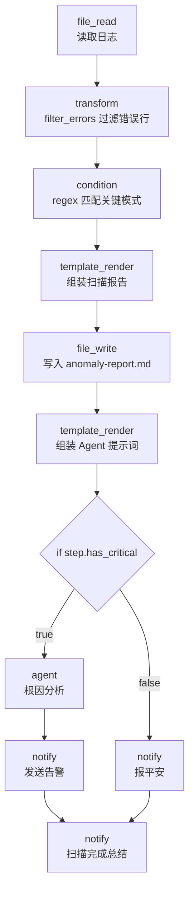

# Log Anomaly Detector

> 日志异常检测：读取日志 → 确定性过滤错误行 → 条件判断是否含关键模式 → if/else 分支（有异常则 Agent 做根因分析并发告警，无异常则报平安）。

## 使用场景

运维/SRE 场景下对服务日志做**分层异常检测**：

1. **确定性过滤**：`transform(filter_errors)` 按关键字（error/fail/exception/fatal）过滤出错误行——零成本、可复现。
2. **条件分支**：`condition` 节点用正则匹配"关键模式"（panic/FATAL/OOM/segfault），输出 `true`/`false`。
3. **if/else 分支**：
   - **有异常**：调用 `agent` 做根因分析（blast radius + 缓解措施），并发送告警。
   - **无异常**：仅输出"OK"状态，不打扰值班人员。

典型用途：定时巡检服务日志、CI 失败日志诊断、容器崩溃后自动根因分析。

## 节点流程图



## 输入

| 参数 | 说明 | 默认值 | 必填 |
|------|------|--------|------|
| `log_path` | 待检测的日志文件路径 | `examples/real-world/log-anomaly-detector/sample.log` | 否 |
| `critical_pattern` | 关键异常正则（命中即触发告警分支） | `panic\|FATAL\|OOM\|out of memory\|segfault` | 否 |
| `provider` | LLM 供应商（仅告警分支用到） | `ollama` | 否 |
| `model` | 模型名 | `llama3` | 否 |
| `alert_channel` | 通知渠道：`stdout` / `slack` / `discord` / `telegram` / `webhook` | `stdout` | 否 |
| `report_path` | 报告输出路径 | `anomaly-report.md` | 否 |

## 运行命令

```bash
# 0. 准备一份示例日志（也可用自己的日志文件）
cat > /tmp/app.log <<'EOF'
2026-07-27 10:00:01 INFO  server started on :8080
2026-07-27 10:01:23 WARN  slow query took 3.2s
2026-07-27 10:02:45 ERROR database connection refused
2026-07-27 10:02:46 FATAL panic: runtime error: nil pointer dereference
EOF

# 1. 用示例日志运行（会命中 FATAL/panic，触发告警分支）
aflare run examples/real-world/log-anomaly-detector/workflow.yaml \
  --var log_path=/tmp/app.log

# 2. 自定义关键模式
aflare run examples/real-world/log-anomaly-detector/workflow.yaml \
  --var log_path=/var/log/myapp.log \
  --var critical_pattern="OutOfMemoryError|StackOverflow|CassandraException"

# 3. 告警发到 Slack（需配置 webhook url）
aflare run examples/real-world/log-anomaly-detector/workflow.yaml \
  --var alert_channel=slack \
  --var log_path=/var/log/myapp.log
```

> **本地 dry-run**：无异常分支不依赖 LLM，可完整跑通；有异常分支的 `agent` 节点需要 Ollama。`workflow.yaml` 语法始终合法。

## 输出示例

**场景 A：命中关键模式（FATAL/panic）**

控制台：

```
ALERT: critical anomalies detected in /tmp/app.log. Report at anomaly-report.md.
Scan complete. has_critical=true. Report written to anomaly-report.md.
```

`anomaly-report.md`：

```markdown
# Log Anomaly Scan Report

**Log file:** /tmp/app.log
**Critical pattern:** `panic|FATAL|OOM|out of memory|segfault`
**Critical hit:** true

---

## Filtered Error Lines

```
2026-07-27 10:02:45 ERROR database connection refused: dial tcp 10.0.0.5:5432
2026-07-27 10:02:46 FATAL panic: runtime error: invalid memory address or nil pointer dereference
2026-07-27 10:02:46 ERROR goroutine 42 [running]: main.handleRequest(...)
2026-07-27 10:03:15 ERROR context deadline exceeded
```
```

Agent 根因分析（if/else then 分支输出）：

```markdown
## Root Cause
The `panic: nil pointer dereference` at 10:02:46 was preceded by a
`database connection refused` error. Likely a missing nil-check on the
DB client after connection failure.

## Blast Radius
Single process crash; :8080 service unavailable until restart.

## Mitigation
1. Add nil-check after `db.Connect()`.
2. Enable connection-pool retries with backoff.
3. Add liveness probe + auto-restart.
```

**场景 B：无关键模式**

控制台：

```
OK: no critical anomalies in /tmp/app.log. Report at anomaly-report.md.
Scan complete. has_critical=false. Report written to anomaly-report.md.
```

## 设计要点

- **确定性 + LLM 分层**：`transform(filter_errors)` 和 `condition(regex)` 是确定性、零成本的；只有命中关键模式才调用 LLM Agent，避免无谓开销。
- **if/else 条件分支**：使用 `WorkflowStep.If`（`then`/`else` 子步骤列表），展示项目条件编排能力——这是 templates 目录里几乎所有模板都没用到的特性。
- **条件表达式技巧**：`if.condition: "{{step.has_critical}}"`——`condition` 节点输出 `"true"`/`"false"` 字符串，表达式引擎把它替换进条件串，得到字面量 `true`/`false`，命中 `evaluateCondition` 的 `case "true"`/`case "false"` 分支。注意：**不能**写成 `equals:true`，因为 `equals:` 比对的是"流入 if 的数据"而非 `step.has_critical` 的值。
- **数据流保真**：`template_render(agent_prompt)` 在 `if` 之前把 `{{step.errors}}` 组装成 Agent 的任务提示词，确保 `if` 的 `then` 分支里 `agent` 节点拿到的是错误行（而非上一步 file_write 的回执）。
- **多通道通知**：`alert_channel` 变量支持 stdout/slack/discord/telegram/webhook，体现 `notify` 节点的多通道能力。
