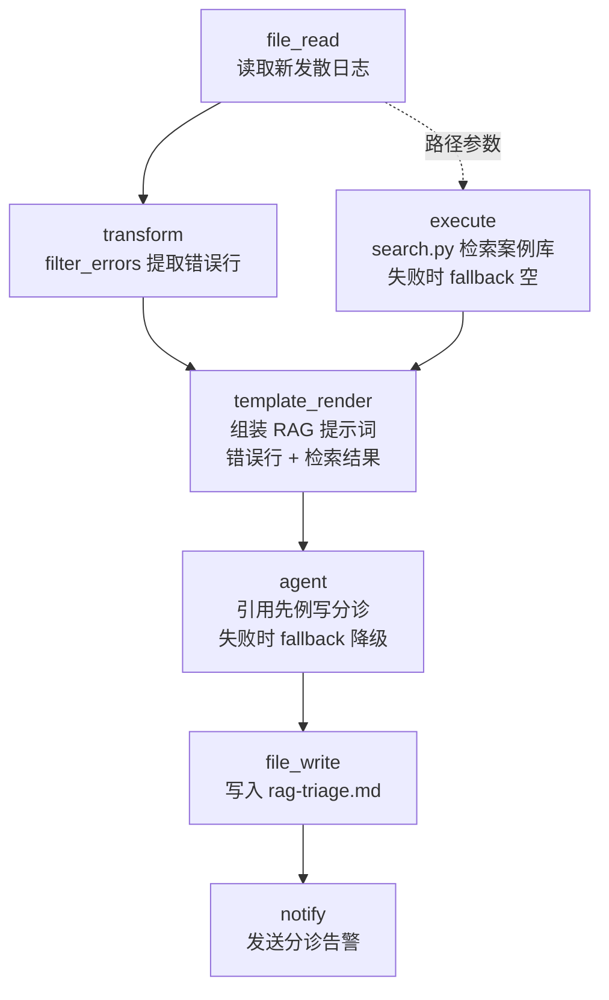

# Log Similarity RAG

> 相似案例检索分诊：读取新发散日志 → 确定性提取错误行 → 检索历史案例库中最相似的先例（关键词重叠或语义嵌入）→ LLM 引用真实先例写分诊笔记。检索与 LLM 双层 fallback 降级，分诊笔记永远能送达。

## 使用场景

这是 [openfoam-watchdog](../openfoam-watchdog/) 的升级版。Watchdog 的 LLM 分诊是从零推理——模型只看眼前的错误行，凭通用 CFD 知识猜原因。但真实团队跑仿真多年，**同样的发散原因反复出现**：时间步过大、网格非正交、边界条件回流……历史事故库里躺着现成的根因和修复方法。

此工作流把"检索历史先例"插入到 LLM 之前：

1. **确定性提取**：`transform(filter_errors)` 从新日志提取错误行——零 LLM 成本。
2. **相似案例检索**：`execute` 调用 [search.py](search.py)（零依赖，仅 Python 标准库），对 [case-library.jsonl](case-library.jsonl) 排序：
   - **`--offline`（默认）**：关键词重叠打分——离线、确定性、可复现，适合 CI 和演示。
   - **`--endpoint`（生产）**：调用 OpenAI 兼容 `/v1/embeddings`（如 vLLM/SGLang 部署的 [tencent/WeMM-Embedding-2B](https://huggingface.co/tencent/WeMM-Embedding-2B)），查询与每个案例症状文本的余弦相似度——语义级匹配，关键词以外的表述也能召回。
3. **LLM 引用式分诊**：`agent` 收到错误行 + 检索到的案例 JSON（含根因和当时生效的修复），被明确指示"引用匹配的 case id、优先采用先例中有效的修复"——从"猜原因"变成"引用真实事故记录"。
4. **双层降级**：检索步骤挂了（embedding 服务不可达）→ `fallback: "[]"`，退化为无先例分诊；LLM 不可达 → `fallback` 占位文本**仍携带检索结果**。分诊链路永不因组件不可用而中断。

## 节点流程图



## 输入

| 参数 | 说明 | 默认值 | 必填 |
|------|------|--------|------|
| `log_path` | 新发散日志路径 | `sample-new-divergence.log` | 否 |
| `library_path` | 历史案例库（JSONL） | `case-library.jsonl` | 否 |
| `top_k` | 返回最相似的前 K 个案例 | `2` | 否 |
| `embed_args` | 检索模式参数 | `--offline` | 否 |
| `triage_path` | 分诊笔记输出路径 | `rag-triage.md` | 否 |
| `alert_channel` | 通知渠道 | `stdout` | 否 |
| `provider` / `model` | LLM 供应商与模型 | `ollama` / `llama3` | 否 |

## 运行命令

```bash
# 1. 离线 mock 模式（关键词检索，零外部依赖；execute 需要解锁白名单）
AFLARE_EXECUTE_UNSAFE=1 aflare run examples/real-world/log-similarity-rag/workflow.yaml

# 2. 语义检索模式（WeMM-Embedding via vLLM/SGLang，OpenAI 兼容端点）
AFLARE_EXECUTE_UNSAFE=1 aflare run examples/real-world/log-similarity-rag/workflow.yaml \
  --set 'embed_args=--endpoint http://localhost:8000/v1/embeddings --model tencent/WeMM-Embedding-2B'

# 3. 监控真实案例（配合 openfoam-watchdog 的告警链路）
AFLARE_EXECUTE_UNSAFE=1 aflare run examples/real-world/log-similarity-rag/workflow.yaml \
  --set log_path=/srv/sim/motorBike/log.foamRun --set alert_channel=slack

# 4. 语法验证（零依赖）
aflare validate examples/real-world/log-similarity-rag/workflow.yaml
```

> **关于 `AFLARE_EXECUTE_UNSAFE=1`**：aflare 的 execute 节点默认白名单只放行只读命令（cat/grep/ls...），`python3` 这类可执行任意逻辑的解释器**故意不在白名单内**。本示例需要运行 Python 脚本，因此要求显式解锁——这是知情选择，不是缺陷：命令会完整写入 `~/.config/aflare/audit.log`。不设置该变量时，检索步骤走 `fallback: "[]"` 降级为无先例分诊，工作流仍能完成。

## 输出示例

默认发散日志（Courant 数飙到 6.04 + `FOAM FATAL ERROR` + continuity errors）在 mock 模式下命中案例库的 **case-001**（分数 0.5，命中 courant/continuity/deltat/transient 四个关键词）：

```
TRIAGE: divergence analyzed against the incident library (.../sample-new-divergence.log). Note: rag-triage.md
```

`rag-triage.md`（Ollama 在线时的 agent 输出结构；离线时为 fallback 文本 + 检索结果 JSON）：

```markdown
## What happened
The run diverged at t=0.044: Courant number climbed from 0.28 to 11.8 in
nine steps, continuity errors grew every outer iteration, and the solver
aborted with 'Continuity errors cannot be removed'.

## Likely causes (ranked)
1. Time step far above the mesh Courant limit — matches case-001, whose
   signature (Courant runaway + continuity errors + FATAL at fixed
   deltaT) is identical to this log.
...

## Next actions
1. Per case-001: enable adjustTimeStep with maxCo=0.5 and restart from
   the last stable time directory (t=0.042)...
```

## 案例库格式

`case-library.jsonl` 每行一个案例：

```json
{
  "id": "case-001",
  "title": "Time step too large — PISO pressure-velocity coupling diverged",
  "symptoms": "Courant number climbed steadily past 1... (用于语义匹配的完整症状描述)",
  "root_cause": "固定 deltaT 远超网格 Courant 极限...",
  "fix": "启用 adjustTimeStep maxCo=0.5，从最后稳定时间步重启...",
  "keywords": ["courant", "continuity", "deltat", ...]
}
```

`keywords` 供离线模式打分（查询文本对这些词做大小写不敏感的子串匹配，分数 = 命中比例）；`symptoms` 供语义模式做嵌入。积累自己的事故库只需追加 JSONL 行——这正是 RAG 的价值：**检索质量随团队历史沉淀而提升，而工作流本身零改动**。

## 设计要点

- **检索先于生成**：RAG 的核心不是"让 LLM 更聪明"，而是**在调用 LLM 之前用确定性组件缩小问题空间**。错误行提取（transform）和案例检索（search.py）都可离线复现、可单元测试；LLM 只负责"组织语言 + 关联先例"。
- **零依赖脚本**：search.py 只用 Python 标准库（argparse/json/urllib），无 pip 依赖——任何装了 Python 的机器直接可跑。生产中把 `--endpoint` 指向 vLLM 部署的 WeMM-Embedding 即可，编排层代码不变。
- **双层 fallback**：execute 检索失败降级为空集（LLM 仍可纯推理分诊），agent 失败降级为占位文本（检索结果 JSON 仍在，人可以直接读）。组件可用性不绑架告警链路——与 openfoam-watchdog 的"告警不依赖 LLM"一脉相承。
- **`{{var}}` 空默认值陷阱**：引擎把 vars 中的空字符串视为"参数未提供"并拦截运行。因此 `embed_args` 默认值用显式 `--offline` 而非空串——语义更清晰且不触发拦截。
- **多模态检索的路线图**：WeMM-Embedding 支持图像/视频/文档输入。案例库的症状字段可以从纯文本升级为"日志 + 残差收敛曲线截图"的多模态嵌入——后处理脚本（paraView 截图）挂到 execute，检索脚本换成多模态输入，工作流结构不变。
