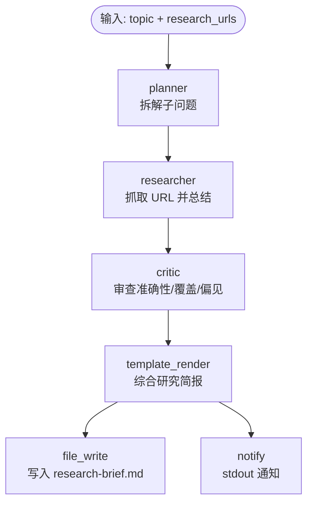

# Multi-Agent Research

> 多智能体协作研究流水线：Planner 拆解问题 → Researcher 检索资料 → Critic 审查偏见与缺口 → 综合成结构化研究简报。

## 使用场景

面对一个开放性研究问题（技术选型、市场调研、学术综述），单个 Agent 一次性回答往往**覆盖不全且带偏见**。本技能用三个角色化 Agent 串行协作：

1. **Planner（规划器）**：把大问题拆成 6 个以内的子问题，输出研究计划。
2. **Researcher（研究员）**：根据给定 URL 列表抓取并总结资料，输出带来源的发现。
3. **Critic（批评者）**：从事实准确性、来源覆盖、偏见、完整性四个维度审查 Researcher 的输出，给出改进建议。
4. **Synthesis（综合）**：`template_render` 把三方产物汇成一份研究简报，提醒读者优先看 Critic 建议。

典型用途：技术选型对比、并购尽调资料整理、论文综述初稿。

## 节点流程图



## 输入

| 参数 | 说明 | 默认值 | 必填 |
|------|------|--------|------|
| `topic` | 研究问题 | RAG vs 微调的权衡 | 否 |
| `research_urls` | 逗号分隔的资料 URL 列表 | arxiv RAG 论文 + IBM 博客 | 否 |
| `depth` | 研究深度：`basic` / `detailed` / `comprehensive` | `detailed` | 否 |
| `provider` | LLM 供应商 | `ollama` | 否 |
| `model` | 模型名 | `llama3` | 否 |
| `report_path` | 简报输出路径 | `research-brief.md` | 否 |

## 运行命令

```bash
# 1. 默认研究问题：RAG vs 微调
llm-box run examples/real-world/multi-agent-research/workflow.yaml

# 2. 自定义研究问题与资料来源
llm-box run examples/real-world/multi-agent-research/workflow.yaml \
  --var topic="Should we migrate from Postgres to MongoDB?" \
  --var research_urls="https://example.com/pg-vs-mongo,https://example.com/case-study"

# 3. 深度研究 + 云端强模型
llm-box run examples/real-world/multi-agent-research/workflow.yaml \
  --var depth=comprehensive \
  --var provider=anthropic --var model=claude-3-5-sonnet-latest
```

> **本地 dry-run**：三个 Agent 节点均依赖 LLM。未启动 Ollama 时它们会失败；但 `workflow.yaml` 语法始终合法，可用 `llm-box run --dry-run`（如可用）校验结构与表达式。

## 输出示例

控制台：

```
Research brief written to research-brief.md.
```

`research-brief.md` 结构：

```markdown
# Research Brief

**Question:** What are the trade-offs between RAG and fine-tuning for enterprise LLM deployment?

## 1. Research Plan (Planner)
1. What data freshness requirements does the enterprise have?
2. What is the cost of fine-tuning vs. maintaining a RAG index?
3. How do latency and accuracy compare?
...

## 2. Findings (Researcher)
Based on [1] and [2]:
- RAG excels when knowledge updates frequently...
- Fine-tuning better captures style and domain-specific reasoning...

## 3. Critical Review (Critic)
- **Factual accuracy:** Claims about RAG latency are well-supported.
- **Source coverage:** Only 2 sources; consider adding a survey paper.
- **Bias:** Sources are RAG-vendor-affiliated; seek counter-evidence.
- **Completeness:** Missing discussion of hybrid approaches.

## 4. Synthesis
The brief above was produced by three cooperating agents...
```

## 设计要点

- **角色化 Agent 编排**：`planner` → `researcher` → `critic` 三个语义化节点串行，每个节点输入自然承接上一步输出，体现项目"多 Agent 协作"特色（而非单个 `agent` 节点硬塞所有逻辑）。
- **Critic 的独立审查**：`critic` 节点以 `criteria` 参数显式指定四个审查维度，输出结构化改进建议，避免"自卖自夸"式总结。
- **跨步综合**：`template_render` 同时引用 `{{step.plan}}`、`{{step.research}}`、`{{step.critique}}`，把三方产物汇成一份可读简报。
- **可扩展**：替换 `provider`/`model` 即可在本地 Ollama 与云端模型间切换；调整 `research_urls` 可重定向资料来源。
