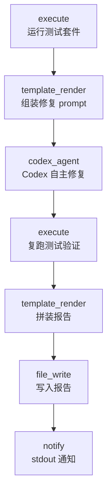

# Nightly CI Fix

> 定时自主 CI 修复回路：跑测试 → 把失败输出交给 Codex 代理诊断并修复 → 重跑测试验证 → 落盘报告。配合 aflare 内置调度器实现无人值守的 nightly 运行。

## 使用场景

夜间定时运行完整测试套件；若有失败，由 [OpenAI Codex CLI](https://github.com/openai/codex)（`codex exec` 非交互模式）在沙箱内自主修复根因，再复跑测试确认修复有效，最后生成 Markdown 报告。aflare 负责调度、编排、超时与通知，Codex 负责代理式的代码修复循环——这正是 aflare 作为 Codex harness 编排层的典型用法。

## 节点流程图



## 前置条件

1. **codex CLI 已安装并认证**（`codex --version` 可用，`OPENAI_API_KEY` 已设置）。
2. **设置 `AFLARE_EXECUTE_UNSAFE=1`**：默认的 execute 命令白名单不含 `go`，且禁止 `|`、`2>&1` 等元字符。本示例需要在受信任的环境（你自己的 CI 机器）中运行完整测试命令，因此必须显式关闭白名单。所有命令仍会写入审计日志（`~/.config/aflare/audit.log`）。
3. 工作目录即目标代码仓库（codex_agent 默认在当前目录工作）。

## 输入

| 参数 | 说明 | 默认值 | 必填 |
|------|------|--------|------|
| `test_command` | 测试命令（含输出截断） | `go test ./... -count=1 -short 2>&1 \| tail -n 200` | 否 |
| `codex_sandbox` | Codex 沙箱级别：`strict` / `permissive` / `danger-full-access` | `permissive`（修复需要写文件） | 否 |
| `codex_timeout` | 单次修复步骤超时（最大 60m） | `30m` | 否 |
| `report_path` | 报告输出路径 | `nightly-ci-fix-report.md` | 否 |

需要指定 Codex 模型时，在 workflow 的 `codex_agent` 步骤里加一行 `model: gpt-5.6`（缺省用 codex CLI 自己的默认模型）。

## 运行命令

```bash
# 手动跑一次（验证链路）
export AFLARE_EXECUTE_UNSAFE=1   # go/管道不在默认白名单，详见"前置条件"
aflare run examples/real-world/nightly-ci-fix/workflow.yaml

# 注册 nightly 调度（每天 02:00）
aflare schedule add --id nightly-ci-fix \
  --cron "0 2 * * *" \
  examples/real-world/nightly-ci-fix/workflow.yaml

# 启动调度器（前台；生产环境建议 systemd 托管，Environment=AFLARE_EXECUTE_UNSAFE=1）
aflare schedule start

# 查看已注册任务 / 移除
aflare schedule list
aflare schedule remove nightly-ci-fix
```

指定沙箱级别（例如只诊断不改动）：

```bash
aflare run examples/real-world/nightly-ci-fix/workflow.yaml \
  --set codex_sandbox=strict
```

## 输出示例

控制台：

```
Nightly CI fix finished. Report written to nightly-ci-fix-report.md.
```

`nightly-ci-fix-report.md` 片段：

```markdown
# Nightly CI Fix Report

Generated: 2026-08-21T02:00:03Z

## Codex fix summary

The failure was caused by a nil map access in transform.go:60 ...

## Verification run (after fix)

```
ok  github.com/alib8b8/aflare/internal/nodes   1.214s
...
```
```

## 设计要点

- **`| tail` 让失败可流转**：管道的退出码是 `tail` 的（恒为 0），所以测试失败不会让 `execute` 步骤报错中断——失败输出才能作为输入流到 `codex_agent`。`verify` 步骤同理：修复不彻底时报告会如实记录仍在失败的输出，而不是让工作流崩溃。
- **沙箱降级为 permissive**：自动修复需要写仓库文件；如只想要"诊断不改动"，把 `codex_sandbox` 改回 `strict`，Codex 将输出修复建议而不落盘。
- **approval_policy=never**：nightly 无人值守场景没有人在旁边审批；有审批需求的场景参见 `pr-review-gate` 示例（human_in_loop 门控 + resumable 暂停恢复）。
- **verify 步骤独立复跑**：修复是否有效由真实测试判定，而不是采信 Codex 的自述；两段输出都进报告，便于事后审计。
- **prompt 单 argv 传入**：测试输出作为 `codex exec` 的单个参数传递，不经 shell，输出内容无法注入命令行。
- **调度复用 aflare schedule**：cron 校验、任务持久化、信号优雅退出均由内置调度器提供，无需额外 crontab。
