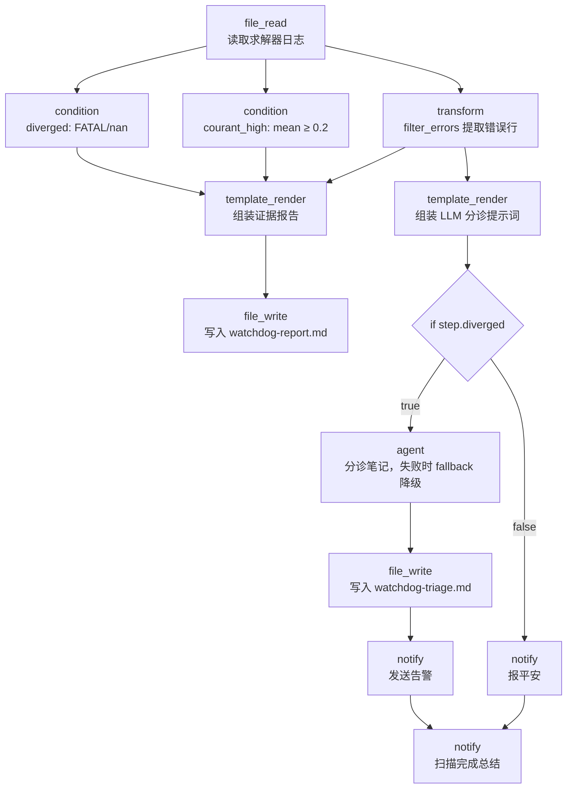

# OpenFOAM Watchdog

> 仿真作业看门狗：读取求解器日志 → 确定性检测发散/高 Courant 数 → 提取错误行证据 → if/else 分支（发散则 LLM 分诊笔记 + 告警；健康则安静报告）。告警不依赖 LLM 可用性。

## 使用场景

CAE 仿真作业一跑几小时到几天，**夜间发散没人发现，早上来 8 小时白跑**是 CFD 工程师的经典痛点。此工作流演示 aflare 作为仿真作业编排层的最小闭环：

1. **确定性检测**：`condition(regex)` 直接对完整日志判定发散（`FATAL` / `Floating point` / `nan`）和高 Courant 数（mean ≥ 0.2）；`transform(filter_errors)` 确定性提取错误行作为证据。零 LLM 成本、可复现。
2. **LLM 只写叙述**：发散时的分诊笔记（What happened / Likely causes / Next actions）由 `agent` 节点起草，但**所有数字来自确定性提取的错误行**——LLM 被明确指示"不得编造数字"。幻觉风险被结构隔离。
3. **告警不依赖 LLM**：`agent` 步骤带 `fallback`——即使 Ollama 离线或未配置，步骤降级为占位说明，告警照常发出。看门狗的可靠性不因 AI 组件不可用而受损。
4. **if/else 分支**：健康运行只输出一行 OK，不打扰值班工程师。

生产环境把 `file_read` 换成 `execute` + `tail $CASE/log.foamRun`（或经 HTTP 网关读取集群上的日志）即可；再加 `schedule` 节点定时运行就是完整的夜间看门狗。

## 节点流程图



## 输入

| 参数 | 说明 | 默认值 | 必填 |
|------|------|--------|------|
| `log_path` | 求解器日志路径 | `examples/real-world/openfoam-watchdog/sample-diverged.log` | 否 |
| `report_path` | 证据报告输出路径 | `watchdog-report.md` | 否 |
| `triage_path` | LLM 分诊笔记输出路径 | `watchdog-triage.md` | 否 |
| `alert_channel` | 通知渠道：`stdout` / `slack` / `discord` / `telegram` / `webhook` | `stdout` | 否 |
| `provider` | LLM 供应商（仅发散分支用到） | `ollama` | 否 |
| `model` | 模型名 | `llama3` | 否 |

## 运行命令

```bash
# 1. 发散场景（默认示例，触发告警分支；Ollama 在线则生成分诊笔记，
#    离线则 fallback 降级为占位说明，告警照常发出）
aflare run examples/real-world/openfoam-watchdog/workflow.yaml

# 2. 健康场景（安静分支，零 LLM 依赖，可完整跑通）
aflare run examples/real-world/openfoam-watchdog/workflow.yaml \
  --set log_path=examples/real-world/openfoam-watchdog/sample-healthy.log

# 3. 监控真实案例目录（需已在运行）
aflare run examples/real-world/openfoam-watchdog/workflow.yaml \
  --set log_path=/path/to/motorBike/log.foamRun \
  --set alert_channel=slack

# 4. CI 中验证语法（零依赖）
aflare validate examples/real-world/openfoam-watchdog/workflow.yaml
```

## 输出示例

**场景 A：发散**（`sample-diverged.log`——残差不降反升，Courant 数冲到 6.04，最终 `FOAM FATAL ERROR`）

```
ALERT: OpenFOAM case diverged (.../sample-diverged.log). Triage note: watchdog-triage.md. Evidence report: watchdog-report.md.
Watchdog scan complete. diverged=true, courant_high=true. Report: watchdog-report.md.
```

证据报告（`watchdog-report.md`，确定性生成，每次运行完全一致）：

```markdown
# OpenFOAM Watchdog Report

**Log file:** examples/real-world/openfoam-watchdog/sample-diverged.log
**Diverged:** true
**High Courant (mean >= 0.2):** true

## Error lines (filter_errors)

```
Floating point exception
--> FOAM FATAL ERROR:
Continuity errors cannot be removed.  To debug, set the environmental variable FOAM_SIGFPE to abort.
```
```

LLM 分诊笔记（then 分支输出，数字全部来自确定性提取的错误行；Ollama 离线时为 fallback 占位说明）：

```markdown
## What happened
The run aborted with a floating point exception; continuity errors could
not be removed.

## Likely causes (ranked)
1. Diverging pressure-velocity coupling (PISO) — continuity errors are the
   classic symptom.
2. Time step too large relative to the mesh Courant limit.
3. Mesh quality issue near high-curvature cells.

## Next actions
1. Reduce deltaT (or enable adjustTimeStep with maxCo=0.5) and restart
   from the last stable time.
2. Run checkMesh; fix non-orthogonality above 70.
3. Re-check inlet/outlet BC pairs.
```

**场景 B：健康**（`sample-healthy.log`——残差单调下降，Courant 稳定在 0.03）

```
OK: OpenFOAM case healthy, residuals decreasing (.../sample-healthy.log).
Watchdog scan complete. diverged=false, courant_high=false. Report: watchdog-report.md.
```

## 设计要点

- **确定性优先**：发散/高 Courant 判定是纯正则，零成本、可复现、可审计——这正是工业客户对 AI 工具的核心诉求。LLM 只在需要"组织语言"时才被调用。
- **LLM 不碰数字**：`triage_prompt` 模板把确定性提取的错误行直接嵌入提示词，并明确指示"Do not invent numbers"。指标提取（transform/condition）与叙述生成（agent）结构分离。
- **数据流保真**：`template_render(triage_prompt)` 在 `if` 之前组装——分支子工作流**不继承父级 step 输出**（`{{step.*}}` 在分支内指向分支自己的步骤），所以所有跨步骤引用都必须在父流程完成，分支内只用 `{{var.*}}`。
- **`input:` 覆盖打破线性链**：默认数据流是"上一步输出→下一步输入"的线性链。两个 `condition` 都需要原始日志而非上一个 condition 的 `"true"`/`"false"`，用 `input: "{{step.read_log}}"` 显式指定输入源。
- **if/else 条件技巧**：`if.condition: "{{step.diverged}}"`——condition 节点输出 `"true"`/`"false"` 字符串，表达式引擎替换后命中 `evaluateCondition` 的字面量分支。**不能**写 `equals:true`（比对的是流入 if 的数据而非 step 值）。
- **fallback 降级**：`agent` 步骤声明 `fallback` 后，节点失败时输出降级为该占位字符串并继续执行——告警链路永不被 LLM 可用性绑架。
- **诚实边界**：这是编排层看门狗，不是实时控制——毫秒级回路属于 PLC/DCS；求解器本身（OpenFOAM）也只被监控，不被替代。
