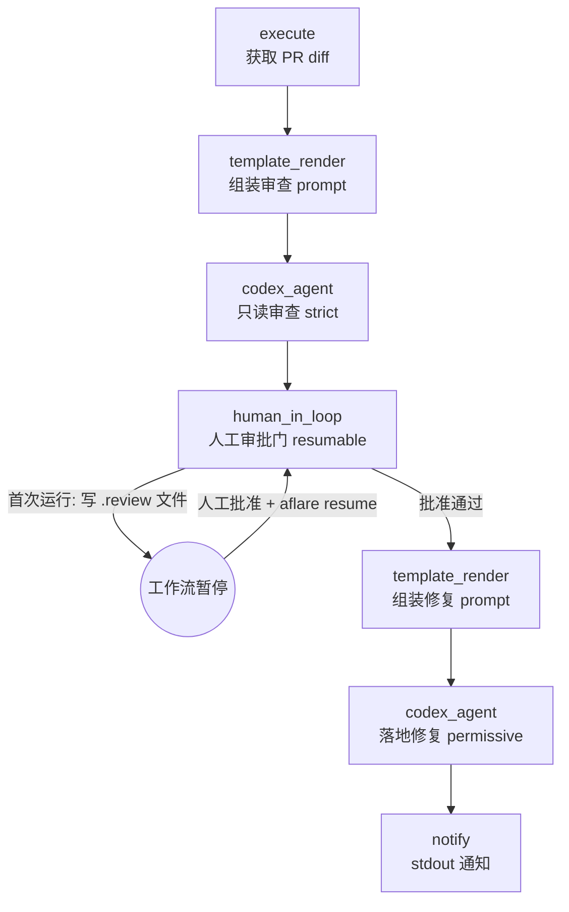

# PR Review Gate

> 审批门控的 Codex PR 审查：Codex 在只读沙箱中审查 diff → 工作流在人工审批门处暂停（可恢复）→ 人工批准后第二个 Codex 运行才落地修复。

## 使用场景

在合并 PR 之前跑一次"代理审查 + 人工把关 + 代理修复"的完整回路：

1. **审查（只读）**：第一个 `codex_agent` 步骤以 `sandbox: strict` 运行——Codex 可以读代码、产出缺陷清单，但不能改任何文件。
2. **人工审批门**：`human_in_loop` 步骤标记为 `resumable: true`。首次运行时它把审查结论写入 `aflare-pr-review-approve.review` 并让工作流**暂停**（不是失败），WAL 已保存，之前的审查结果不会丢。
3. **修复（落盘）**：人工审阅结论后创建批准标志文件并 `aflare resume`，第二个 `codex_agent` 步骤以 `sandbox: permissive` 只执行被批准的修复。

这是把 aflare 当作 Codex harness 编排层的核心卖点：**调度、审批门、暂停恢复、审计由 aflare 控制；代理循环由 Codex 执行**。

## 节点流程图



## 前置条件

1. **codex CLI 已安装并认证**（`codex --version` 可用，`OPENAI_API_KEY` 已设置）。
2. **设置 `AFLARE_EXECUTE_UNSAFE=1`**：默认的 execute 命令白名单不含 `git`，且禁止 `|` 管道。本示例在受信任的环境（你自己的开发机 / CI）中运行，需显式关闭白名单；所有命令仍写入审计日志（`~/.config/aflare/audit.log`）。
3. 当前目录是特性分支的 git 仓库（diff 基于 `base_branch` 计算）。

## 输入

| 参数 | 说明 | 默认值 | 必填 |
|------|------|--------|------|
| `base_branch` | diff 的基准分支 | `main` | 否 |
| `review_sandbox` | 审查阶段沙箱（建议保持 `strict` 只读） | `strict` | 否 |
| `fix_sandbox` | 修复阶段沙箱 | `permissive` | 否 |
| `codex_timeout` | 每个阶段超时（最大 60m） | `20m` | 否 |
| `approval_file` | 批准标志文件路径 | `aflare-pr-review-approve` | 否 |
| `report_path` | 修复摘要输出路径 | `pr-review-fix-summary.md` | 否 |

需要指定 Codex 模型时，在 workflow 的 `codex_agent` 步骤里加一行 `model: gpt-5.6`（缺省用 codex CLI 自己的默认模型）。

## 运行命令

```bash
export AFLARE_EXECUTE_UNSAFE=1   # git/管道不在默认白名单，详见"前置条件"

# 1. 在特性分支上启动审查（会暂停在审批门，打印 run-id）
aflare run examples/real-world/pr-review-gate/workflow.yaml

# 2. 人工审阅结论
cat aflare-pr-review-approve.review

# 3a. 满意 → 创建批准标志并恢复工作流
touch aflare-pr-review-approve
aflare resume <run-id>

# 3b. 不满意 → 直接放弃（删除标志文件与 .review 文件即可）
#    rm aflare-pr-review-approve.review

# 4. 恢复后：修复完成，检查工作树再提交
git diff
```

查看所有暂停中的运行：

```bash
aflare resume --list   # 或按提示选择 run-id
```

## 输出示例

首次运行（暂停在审批门）：

```
workflow paused  name=PR Review Gate step=4 node=human_in_loop run_id=run-20260821-041233
human approval required: review aflare-pr-review-approve.review,
then create aflare-pr-review-approve to approve
```

批准并恢复后：

```
PR review gate finished: findings applied after human approval.
Review the working tree before committing.
```

## 设计要点

- **两段沙箱降级**：审查 `strict`（只读）→ 修复 `permissive`（可写）。代理的破坏半径由沙箱级别显式约束，而不是靠 prompt 约定。
- **暂停而非失败**：`resumable: true` + `resume_on: manual` 让审批门成为真正的工作流暂停点；WAL 保存了已完成的审查输出，恢复时**不会**重新调用 Codex 审查（省一次代理运行，结论前后一致）。
- **审批信号是文件存在性**：`mode: file` 下，标志文件存在即批准——便于在 CI 里用 `touch` / 环境变量 / webhook 各种方式驱动。
- **prompt 单 argv 传入**：diff 与审查结论作为 `codex exec` 的单个参数传递，不经 shell，内容无法注入命令行。
- **修复范围受控**：修复 prompt 明确"只执行被批准的结论、不额外重构、不删测试"，且最终由人审 `git diff` 收尾。
