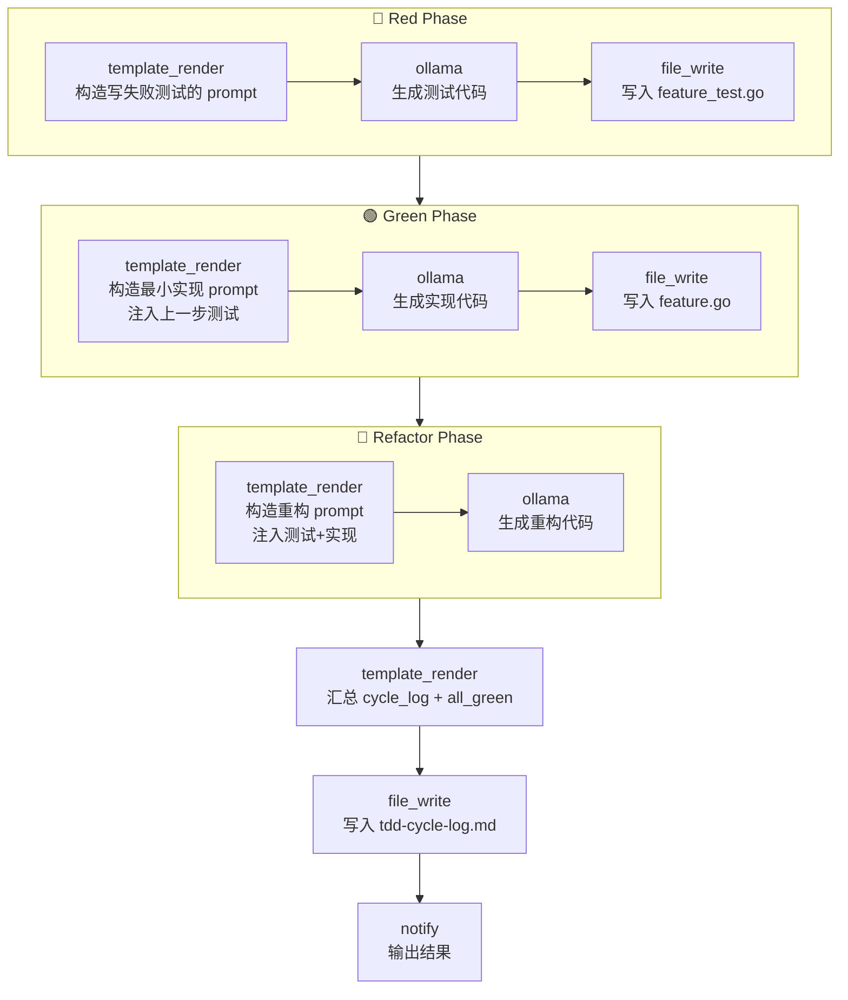

# TDD 约束技能

> 约束型技能：严格遵循红-绿-重构（Red-Green-Refactor）循环，测试先行。每个阶段都是独立的、有序的 LLM 步骤，纪律无法被跳过或合并。借鉴自 [mattpocock/skills](https://github.com/mattpocock/skills) 的 `/tdd` 设计理念。

## 设计理念

`mattpocock/skills` 的 `/tdd` 用工作流硬编码 TDD 纪律：**先写一个会失败的测试（红），再写让它通过的最小实现（绿），最后在不改变行为的前提下重构**。本技能把这三阶段拆成三个独立的、顺序固定的 LLM 节点——模型无法"一步到位"把测试和实现一起写出来，也无法跳过重构。

这是一种**agent-discipline（智能体自律）**型约束：与其相信模型会自觉遵守 TDD，不如用工作流编排把纪律变成不可绕过的步骤序列。

## 红绿重构三阶段

| 阶段 | 节点 | 纪律 | 产物 |
|------|------|------|------|
| 🔴 Red | `template_render` → `ollama` → `file_write` | 只写**失败的测试**，禁止写实现 | `feature_test.go` |
| 🟢 Green | `template_render` → `ollama` → `file_write` | 只写**最小实现**让测试通过，不修改测试 | `feature.go` |
| 🔵 Refactor | `template_render` → `ollama` | **不改行为**地改进代码，测试必须仍通过 | 重构后的实现 |

每个 `template_render` 步骤都用 CONSTRAINTS 块显式声明该阶段的边界——例如 Green 阶段写"Do NOT modify the test"，Refactor 阶段写"The tests MUST still pass after refactoring"。

## 使用场景

- 想让 AI 按 TDD 纪律为新功能产出可运行的测试 + 实现。
- 教学 / 演示红绿重构循环如何用 workflow 节点编排。
- 给团队约定"AI 生成的代码必须配失败测试先行"的产出标准。
- 作为 CI 前置步骤：先生成测试骨架，再生成实现，避免无测试的裸实现。

## 工作流程



## 输入

| 参数 | 说明 | 默认值 | 必填 |
|------|------|--------|------|
| `feature_description` | 要实现的功能描述 | （空） | 是 |
| `language` | 编程语言（决定测试/实现的命名约定） | `go` | 否 |
| `max_cycles` | 最大红绿重构循环次数（约束上界） | `5` | 否 |
| `provider` | LLM 供应商 | `ollama` | 否 |
| `model` | 模型名 | `llama3` | 否 |

## 输出

| 输出 | 说明 |
|------|------|
| `test_code` | 生成的测试代码（Red 阶段产物，落盘到 `feature_test.go`） |
| `impl_code` | 生成的实现代码（Green 阶段产物，落盘到 `feature.go`） |
| `cycle_log` | 循环过程记录（三阶段产物 + 汇总） |
| `all_green` | 是否全部测试通过（重构后预期为 `true`） |

## 运行命令

```bash
# 1. 默认：用 Go 写一个功能的 TDD 三阶段
llm-box run examples/real-world/tdd/workflow.yaml \
  --var feature_description="实现一个限流器：令每秒最多 N 个请求通过，超出则排队等待"

# 2. 切换语言（Python），并自定义产物文件名
llm-box run examples/real-world/tdd/workflow.yaml \
  --var feature_description="实现一个 LRU 缓存，支持 get/put 和容量上限" \
  --var language=python \
  --var test_file=lru_cache_test.py \
  --var impl_file=lru_cache.py

# 3. 换用本地其它模型
llm-box run examples/real-world/tdd/workflow.yaml \
  --var feature_description="实现一个环形缓冲区，支持溢出时覆盖最旧元素" \
  --var model=qwen2.5
```

> **本地 dry-run**：本技能的 LLM 步骤依赖 Ollama。`workflow.yaml` 语法始终合法，无需 Ollama 即可加载。生成的测试/实现文件会写入当前目录，可用语言自带的测试命令验证（如 `go test`）。

## 输出示例片段

控制台：

```
TDD cycle complete. all_green=true. Test: feature_test.go, Impl: feature.go, Log: tdd-cycle-log.md.
```

`feature_test.go`（Red 阶段，Go 示例）：

```go
package ratelimit

import (
	"testing"
	"time"
)

func TestLimiterAllowsUpToNPerSecond(t *testing.T) {
	lim := NewLimiter(3) // 每秒 3 个
	for i := 0; i < 3; i++ {
		if !lim.Allow() {
			t.Fatalf("request %d should be allowed", i)
		}
	}
	// 第 4 个请求在同一秒内应被拒绝
	if lim.Allow() {
		t.Fatal("4th request within the same second should be rejected")
	}
	// 等到下一秒应再次放行
	time.Sleep(time.Second)
	if !lim.Allow() {
		t.Fatal("request after window reset should be allowed")
	}
}
```

`feature.go`（Green 阶段，最小实现）：

```go
package ratelimit

import (
	"sync"
	"time"
)

type Limiter struct {
	mu       sync.Mutex
	limit    int
	count    int
	windowAt time.Time
}

func NewLimiter(n int) *Limiter {
	return &Limiter{limit: n, windowAt: time.Now()}
}

func (l *Limiter) Allow() bool {
	l.mu.Lock()
	defer l.mu.Unlock()
	now := time.Now()
	if now.Sub(l.windowAt) >= time.Second {
		l.windowAt = now
		l.count = 0
	}
	if l.count >= l.limit {
		return false
	}
	l.count++
	return true
}
```

`tdd-cycle-log.md`（节选）：

```markdown
# TDD Cycle Log

**Feature:** 实现一个限流器：令每秒最多 N 个请求通过，超出则排队等待
**Language:** go
**Max cycles:** 5
**Provider / Model:** ollama / llama3

## Red Phase — Failing Test
（生成的 feature_test.go 内容）

## Green Phase — Minimal Implementation
（生成的 feature.go 内容）

## Refactor Phase — Improved Implementation
（重构后的实现内容）

## Summary
- **test_code:** saved to `feature_test.go`
- **impl_code:** saved to `feature.go`
- **cycle_log:** this document
- **all_green:** true
- **cycles_used:** 1 of 5
```

## 设计要点

- **纪律即编排**：红绿重构不是建议而是步骤顺序——Red 的 `file_write` 在 Green 的 `template_render` 之前，模型无法跳过写测试就直接写实现。
- **数据流约束**：Green 阶段的 prompt 通过 `{{step.generate_test}}` 注入上一步的测试代码，强制实现"去满足这个测试"；Refactor 阶段同时注入测试和实现，强制"不改测试、不改行为"。
- **CONSTRAINTS 块**：每个 `template_render` 模板内显式列出该阶段禁止项（如"Do NOT modify the test"、"Output ONLY ... code"），把 TDD 纪律固化进 prompt。
- **可重跑**：测试和实现都落盘，生成后可直接用 `go test ./...` 等命令验证 `all_green`，与项目已有的 deterministic 校验衔接。
- **循环上界**：`max_cycles` 约束循环次数，避免模型陷入无限红绿拉锯；当前工作流执行单轮循环，多轮可通过外层调度扩展。
