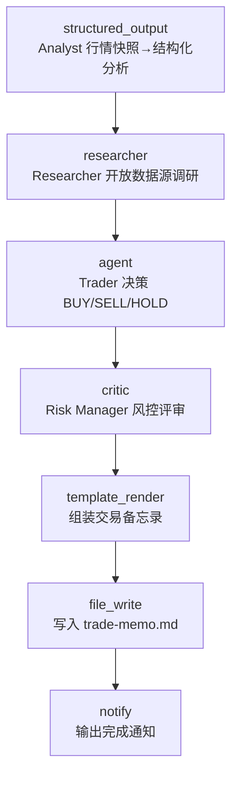

# Trading Agents

> 角色分工型交易台（TradingAgents 范式）：**Analyst** 把原始行情快照结构化 → **Researcher** 从开放数据源收集宏观/新闻上下文 → **Trader** 综合两路输入给出 BUY/SELL/HOLD 提案 → **Risk Manager** 独立评审后归档交易备忘录。

## 使用场景

多智能体角色流水线（analyst → researcher → trader → risk），每个角色一个专职节点、各司其职、逐级交接：

1. **结构化分析**：`structured_output` 把自由文本行情快照钉进 JSON Schema（trend / volatility / key_levels / drivers），后续角色拿到的是规整情报而非原始噪音，temperature=0 保证可复现。
2. **开放式调研**：`researcher` 抓取开放、免密钥的数据源（frankfurter 汇率 API、ECB 参考汇率页）做摘要，不依赖任何商业数据订阅。
3. **决策代理**：`agent` 以交易员系统提示词运行，输入用列表形式**合并两路上游输出**（分析师 JSON + 调研摘要），产出带入场/止损/目标位的一页决策。
4. **独立风控**：`critic` 以风控标准（仓位、方向风险、止损纪律、流动性、事件风险、合规）评审交易提案——评审者与提案者角色分离，是多智能体互查的关键模式。

典型用途：投研流程原型、交易决策日志生成、多智能体编排模式的参考实现。

## 节点流程图



## 输入

| 参数 | 说明 | 默认值 | 必填 |
|------|------|--------|------|
| `symbol` | 交易标的 | `EUR/USD` | 否 |
| `market_snapshot` | 原始行情快照文本（分析师的输入） | 内置示例快照 | 否 |
| `news_urls` | 调研数据源（逗号分隔，开放免密钥） | frankfurter 汇率 API + ECB 参考汇率 | 否 |
| `provider` | LLM 供应商 | `ollama` | 否 |
| `model` | 模型名 | `llama3` | 否 |
| `memo_path` | 备忘录输出路径 | `trade-memo.md` | 否 |

## 运行命令

```bash
# 1. 本地跑通（需 Ollama + llama3）
aflare run examples/real-world/trading-agents/workflow.yaml

# 2. 换成自己的快照与数据源
aflare run examples/real-world/trading-agents/workflow.yaml \
  --set symbol=USD/JPY \
  --set market_snapshot="USD/JPY 149.8, MoF intervention risk elevated..." \
  --set news_urls="https://api.frankfurter.app/latest?from=USD&to=JPY"

# 3. 用云端模型（配好对应 API key 环境变量）
aflare run examples/real-world/trading-agents/workflow.yaml \
  --set provider=deepseek --set model=deepseek-chat
```

## 输出示意

`trade-memo.md`：

```markdown
# Trade Memo — EUR/USD

## 1. Market Analysis (Analyst)
{"symbol":"EUR/USD","trend":"bullish","volatility":"low",
 "key_levels":["1.0810 support","1.0880 resistance"], ...}

## 3. Trade Proposal (Trader)
DECISION: BUY
CONVICTION: MEDIUM
ENTRY / STOP / TARGET: 1.0845 / 1.0810 / 1.0880
RATIONALE: spot bounced off 1.0810 support; rates drift favors EUR carry...

## 4. Risk Review (Risk Manager)
Position sizing within desk limits; stop at 1.0810 aligns with support.
Event risk: FOMC minutes in 48h — consider halving size ahead of release.
```

## 设计要点

- **角色即节点**：四个角色分别落到四个专职节点（`structured_output` / `researcher` / `agent` / `critic`），而不是一个万能 agent 硬扛——每个环节可单独换模型、可单独测试。
- **确定性优先**：分析师用 `structured_output`（temperature=0 + schema 自纠错重试），把最不该发挥的环节钉死；自由决策只留给交易员 agent。
- **两路输入合并**：Trader 步骤用 `input:` 列表形式同时引用 `{{step.analyst}}` 和 `{{step.research}}`（以 `\n---\n` 连接）——这是无需 combine 节点的最短数据流写法。
- **提案与评审分离**：风控是 `critic` 对 Trader 输出的独立评审，不是 Trader 自评——多智能体互查的最低配置。
- **零商业依赖**：默认数据源全部开放免密钥（frankfurter / ECB），默认模型本地可跑（Ollama），克隆即用。
- **免责声明内嵌**：备忘录模板尾部自带"仅供研究教育、非投资建议"声明。

> **声明**：本示例演示多智能体编排模式，不构成任何投资建议。
